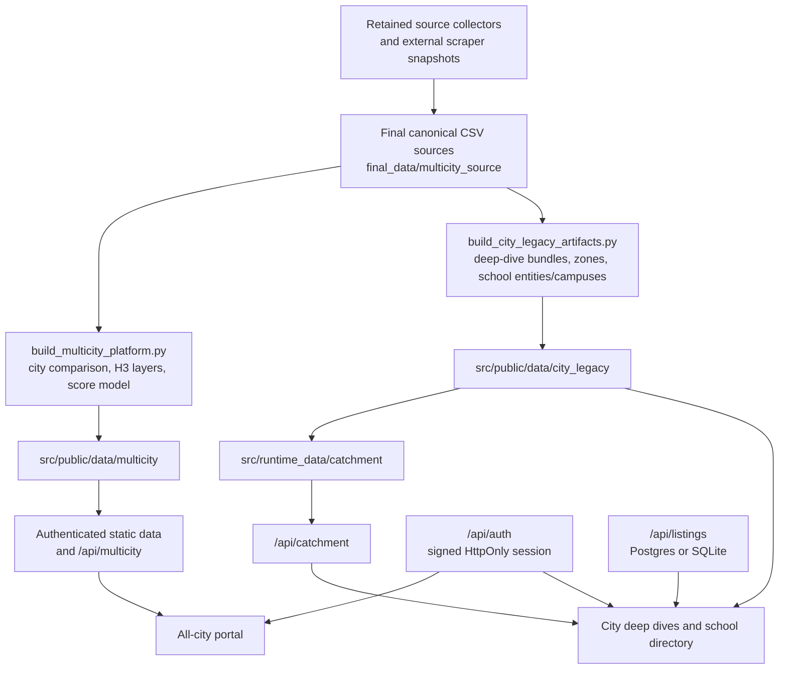

# RanchoLabs Market Intelligence Portal

Private source repository for Rancho's multi-city school-market, spatial-demand,
catchment, and site-selection platform.

Production portal: [ranchoblr.vercel.app](https://ranchoblr.vercel.app)

This document is the technical handoff for the retained project after the July
2026 storage cleanup. It explains what is deployed, what data is authoritative,
how every published metric is calculated, how to rebuild and test the system,
and where every retained script family belongs.

> [!IMPORTANT]
> The current deployed methodology is `school-led-market-v3.0`, generated by
> `src/build_multicity_platform.py` and
> `src/build_city_legacy_artifacts.py`. The older Bengaluru affluent-family TAM
> pipeline is retained for reproducibility, but it is not the authority for the
> current four-city school comparison.

## Contents

- [Current production state](#current-production-state)
- [What Rancho does](#what-rancho-does)
- [Architecture and data flow](#architecture-and-data-flow)
- [Repository map](#repository-map)
- [Quick start](#quick-start)
- [Configuration and secrets](#configuration-and-secrets)
- [Authoritative data and count semantics](#authoritative-data-and-count-semantics)
- [School audiences](#school-audiences)
- [Current data inventory](#current-data-inventory)
- [Live methodology and formulas](#live-methodology-and-formulas)
- [Catchment methodology and formulas](#catchment-methodology-and-formulas)
- [Supporting normalization formulas](#supporting-normalization-formulas)
- [Archived Bengaluru TAM methodology](#archived-bengaluru-tam-methodology)
- [Build and refresh workflows](#build-and-refresh-workflows)
- [Application routes and APIs](#application-routes-and-apis)
- [Frontend behavior](#frontend-behavior)
- [Script catalog](#script-catalog)
- [Testing and validation](#testing-and-validation)
- [Deployment](#deployment)
- [Reproducibility, storage, and cleanup policy](#reproducibility-storage-and-cleanup-policy)
- [Known limitations](#known-limitations)
- [Further documentation](#further-documentation)

## Current production state

| Item | Current value |
| --- | --- |
| Portal | `https://ranchoblr.vercel.app` |
| Repository visibility | Private |
| Deploy target | Vercel project `ranchoblr` |
| Python | 3.12 |
| App schema | `multicity-platform-v3` |
| Methodology | `school-led-market-v3.0` |
| Score model | `school_led_expansion_fit_v2` |
| Generated data timestamp | `2026-07-12T11:20:58+00:00` |
| Published cities | Delhi NCR, Bengaluru, Hyderabad, Mumbai |
| Benchmark city | Delhi NCR |
| Ranked candidates | Bengaluru, Hyderabad, Mumbai |
| Spatial grain | H3 resolution 7 |
| School source rows | 29,199 across the complete retained source |
| Bengaluru validated physical campuses | 4,590 |
| Test status at this handoff | 88 passed, 1 skipped |

The portal provides:

- an all-city comparison and recommendation view;
- a deep dive for every published city;
- seven school-audience selections;
- audience-aware H3 demand layers, zone summaries, and candidate catchments;
- source-reported enrollment, residential inventory, office, hospital, and
  locality context;
- a searchable school directory that focuses the selected school on the map;
- live Google drive-time catchments;
- capacity, overlap, and portfolio scenarios;
- saved commercial-listing analysis.

## What Rancho does

Rancho is a decision-support system for answering three related questions:

1. Which city should be investigated next?
2. Within a city, which school-demand corridors and H3 cells deserve field
   validation?
3. Around a proposed site, which schools and residential signals are reachable,
   how much overlap exists with other proposed sites, and what center capacity is
   supportable under explicit capture assumptions?

The system deliberately separates:

- **direct evidence** — source school rows, source-reported enrollment, known
  residential units, offices, hospitals, localities, and coordinates;
- **derived evidence** — Grade 2–9 rollups, H3 concentration, normalized scores,
  and planning scenarios;
- **modeled/contextual evidence** — imputed enrollment, legacy family TAM,
  habitability, commute proxies, and cluster influence.

Modeled enrollment is never used in the primary city ranking. Residential units
are market-depth evidence, not automatically a family count. A planning scenario
is not a forecast or a commitment.

## Architecture and data flow



The two production builders intentionally share definitions from
`src/build_multicity_platform.py`, including canonical city aliases, audience
buckets, H3 utilities, project deduplication, robust normalization, and score
weights.

Large city and H3 artifacts are served as authenticated static files. Compact
manifest, comparison, and score indexes are copied into `src/runtime_data` for
the serverless Python API. Every manifest-declared artifact can carry a SHA-256
hash, which the API verifies before returning it.

## Repository map

| Path | Purpose | Status |
| --- | --- | --- |
| `src/` | Deployable portal, APIs, builders, production static data, and catchment runtime data | Production |
| `src/public/data/multicity/` | Four-city comparison, city details, score model, and category H3 layers | Production artifact |
| `src/public/data/city_legacy/` | City deep-dive artifacts, school entities/campuses, zones, and evidence layers | Production artifact |
| `src/runtime_data/` | Data bundled with Vercel functions | Production artifact |
| `final_data/multicity_source/` | Hash-locked source CSVs for the current build | Authoritative input |
| `collectors/` | Fail-closed multi-city adapters and a two-stage MagicBricks locality collector | Current framework |
| `pipelines/` | Geospatial, school merge, entity processing, orchestration, and reconciliation tools | Current/utility |
| `external_scrapers/` | Compact source-only snapshots of scraper workspaces removed during cleanup | Reusable/legacy |
| `archived_pipelines/` | Bengaluru TAM and final-data transformation source retained without large intermediates | Archived reproducibility |
| `DATA/final/` | Retained final Bengaluru TAM deliverables | Archived deliverable |
| `maps/final/` | Retained final KML/map deliverables | Archived deliverable |
| `config/` | City registry and schema configuration | Current framework |
| `schemas/` | Canonical schema contracts | Current framework |
| `tests/` | Unit, contract, API, frontend-static, and reconciliation tests | Current |
| `docs/` | Methodology, handoff, source mapping, and operational notes | Reference |
| `orchestration/` | Historical multi-agent execution plan, decisions, blockers, and handoffs | Historical audit |
| `FINAL_DATA_CHECKSUMS.sha256` | Checksums for retained final source files | Integrity authority |
| `.env.example` | Names of runtime variables, without secrets | Safe template |
| `MINIMAL_RANCHO_README.md` | Storage-cleanup keep-set and restoration notes | Operations reference |

Large raw responses, scrape databases, virtual environments, browser caches,
routing graphs, temporary maps, and obsolete deployments were intentionally
removed. The retained code and dependency manifests are sufficient to recreate
those disposable layers.

## Quick start

### 1. Clone and enter the repository

```bash
git clone git@github.com:b-harshith/rancho.git
cd rancho
```

### 2. Create a Python environment

```bash
python3.12 -m venv .venv
source .venv/bin/activate
python -m pip install --upgrade pip
python -m pip install -r src/requirements.txt
```

The deployed app dependencies are:

- `requests`
- `h3`
- `shapely`
- `psycopg2-binary`

Individual scraper archives have their own manifests and may need additional
packages such as Playwright, pandas, GeoPandas, Overture CLI, or OCR/PDF tools.
Install those only when rerunning that specific workflow.

### 3. Configure local portal access

```bash
cp .env.example .env
```

Set at least:

```dotenv
PORTAL_PASSWORD=choose-a-local-password
PORTAL_SESSION_SECRET=use-a-long-random-secret
PORTAL_SESSION_TTL_SECONDS=43200
```

Export the values into the shell or load them with your preferred environment
manager. The application does not automatically parse `.env`.

### 4. Start the local portal

```bash
cd src
PORTAL_PASSWORD="$PORTAL_PASSWORD" \
PORTAL_SESSION_SECRET="$PORTAL_SESSION_SECRET" \
python3 server.py
```

Open `http://localhost:8050`. Override the port with `PORT`.

### 5. Run the verification suite

From the repository root:

```bash
shasum -a 256 -c FINAL_DATA_CHECKSUMS.sha256
python3 -m unittest discover -s tests -p 'test_*.py'
```

## Configuration and secrets

The repository contains variable names only:

| Variable | Used by | Meaning |
| --- | --- | --- |
| `PORTAL_PASSWORD` | Auth API | Password exchanged for a signed session |
| `PORTAL_SESSION_SECRET` | Python auth and Vercel middleware | HMAC signing secret |
| `PORTAL_SESSION_TTL_SECONDS` | Auth | Session duration; clamped to 15 minutes–7 days |
| `GOOGLE_MAPS_API_KEY` | Catchment/geocoding scripts | Server-side Google Maps key |
| `ACRES99_SESSION` | Safe collector adapters | Runtime-only 99acres session input |
| `COLLECTOR_USER_AGENT` | Collectors | Identifying user agent |
| `COLLECTOR_CONTACT` | Collectors | Operator contact when source policy requires it |
| `POSTGRES_URL` | Listings API | Optional durable Postgres database |
| `PORT` | Local server and some scraper dashboards | Listening port |

Additional archived workflows may use variables documented inside their own
README or settings module, for example `OSRM_URL`, `UDISE_DB`,
`UDISE_PINCODES`, `UDISE_CHROME`, and `UDISE_HEADLESS`.

Never commit:

- `.env` files;
- Google, OpenAI, Gemini, or other API keys;
- passwords or signing secrets;
- cookies, browser profiles, or session headers;
- SQLite scrape databases;
- CAPTCHA answers or access-control challenge material;
- Vercel local caches or generated virtual environments.

The portal password and signing secret never enter browser JavaScript. Successful
login creates an HMAC-SHA256 signed, expiring, `HttpOnly`, `SameSite=Lax` cookie;
production cookies also use `Secure`. Static data, reports, and APIs are guarded.

## Authoritative data and count semantics

### Why 29,199 and 4,590 are both correct

These numbers describe different grains:

- **29,199** is the number of rows in the retained all-city school master
  `final_data/multicity_source/schools/final_schools.csv`. It includes the four
  published cities and other retained source cities.
- **4,774** is the number of Bengaluru source rows admitted to the city build.
- **4,639** is the number of published Bengaluru school entities after 135 rows
  without valid in-market coordinates were quarantined.
- **4,590** is the number of validated Bengaluru physical campus groups after
  49 colocated entity rows were merged into campus context.

Use the correct count for the question:

| Question | Correct grain |
| --- | --- |
| How large is the retained all-city school source? | 29,199 source rows |
| How many source school records are scoped to Bengaluru? | 4,774 rows |
| How many mapped Bengaluru school institutions are published? | 4,639 entities |
| How many physical Bengaluru map campuses are published? | 4,590 campuses |

Entity and campus IDs are deterministic SHA-1 based IDs. The current city legacy
builder computes:

```text
school_entity_id = SHA1(school_id | udise_code | school_name)
campus_id        = SHA1(google_place_id or school_id | school_name | lat | lon)
```

The hashes are namespaced and truncated by `stable_id`. Rows without valid
in-city coordinates are quarantined rather than placed on a fallback point.

### School entity/campus audit

| City | Input rows | Quarantined | Published entities | Campus rows merged | Physical campuses |
| --- | ---: | ---: | ---: | ---: | ---: |
| Delhi NCR | 8,202 | 29 | 8,173 | 43 | 8,130 |
| Bengaluru | 4,774 | 135 | 4,639 | 49 | 4,590 |
| Hyderabad | 5,534 | 66 | 5,468 | 11 | 5,457 |
| Mumbai | 4,005 | 21 | 3,984 | 31 | 3,953 |

### Enrollment provenance

A row is source-reported only when:

```text
enrollment_source == "UDISE_reported_total"
```

The build keeps four fields separate:

- `reported_enrollment_total` — all-grade enrollment from source-reported rows;
- `reported_students_grade_2_9` — Grade 2–9 enrollment for source-reported rows;
- `modeled_students_grade_2_9` — Grade 2–9 values from non-reported/model rows;
- `combined_students_grade_2_9` — reported plus modeled compatibility total.

Primary rankings and headline decisions use `reported_enrollment_total`.
Campus scenarios and local H3 comparisons use
`reported_students_grade_2_9`. Modeled Grade 2–9 values are disclosed but
excluded from the primary ranking.

The final multi-city builder consumes the already prepared
`enrollment_grade_2_9` field; it does not silently recompute it. In UDISE
extraction code, Grade 2–9 is the sum of class totals for classes 2 through 9:

```text
G2_9 = Σ class_total[g], for g ∈ {2, 3, 4, 5, 6, 7, 8, 9}
```

For unmatched schools, older preparation scripts may use averages from UDISE
schools with the same `(lowest_class, highest_class)`, then the same
`highest_class`, then a citywide fallback. Those rows remain modeled.

## School audiences

The current source has categorical `fee_tier` values, not comparable annual fee
amounts. Therefore the deployed UI supports fixed audiences and does not support
an arbitrary annual-fee slider.

| Audience ID | Display label | Included source tiers |
| --- | --- | --- |
| `super_premium` | Super-Premium | Super-Premium |
| `premium` | Premium | Premium |
| `affordable` | Affordable | Affordable |
| `budget` | Budget | Budget |
| `premium_plus` | Premium + Super-Premium | Super-Premium, Premium |
| `affordable_plus` | Affordable and above | Super-Premium, Premium, Affordable |
| `all_private` | All private schools | All four tiers |

All audience-sensitive UI surfaces—city metrics, H3 layers, zone rollups,
candidate catchments, and the searchable school directory—must use the selected
category. A rollup is a set union by tier, not a sum of independently published
audience totals.

## Current data inventory

### Hash-locked source files

| Layer | Source file | Rows | Bytes |
| --- | --- | ---: | ---: |
| Schools | `schools/final_schools.csv` | 29,199 | 9,899,822 |
| Projects | `Projects/magicbricks_projects_final_master.csv` | 34,959 | 28,637,503 |
| Hospitals | `hospitals/hospitals_all_cities.csv` | 6,203 | 2,557,732 |
| Localities/societies | `localities/real_estate_localities_and_societies.csv` | 15,216 | 5,332,990 |
| Offices | `offices/offices_unified_all_cities.csv` | 18,352 | 7,186,882 |

The exact SHA-256 values are stored in both
`FINAL_DATA_CHECKSUMS.sha256` and the deployed manifest.

### Published city totals

| City | School rows | Reported all-grade enrollment | Reported Grade 2–9 | Canonical projects | Known units | Hospitals | Offices | Locality records |
| --- | ---: | ---: | ---: | ---: | ---: | ---: | ---: | ---: |
| Delhi NCR | 8,202 | 3,682,883 | 2,690,595 | 1,521 | 923,612 | 1,328 | 3,784 | 1,124 |
| Bengaluru | 4,774 | 1,946,218 | 1,325,655 | 8,919 | 1,309,852 | 1,040 | 3,669 | 584 |
| Hyderabad | 5,534 | 2,133,768 | 1,489,578 | 10,413 | 1,088,889 | 1,118 | 1,465 | 2,937 |
| Mumbai | 4,005 | 2,032,152 | 1,441,608 | 8,124 | 1,107,954 | 901 | 5,389 | 16 |

### Audience totals

Each cell is `school rows / reported all-grade enrollment / reported Grade 2–9`.

| City | Super-Premium | Premium | Affordable | Budget | Premium+ | Affordable+ | All private |
| --- | --- | --- | --- | --- | --- | --- | --- |
| Delhi NCR | 22 / 7,943 / 5,378 | 412 / 406,407 / 273,343 | 2,372 / 1,157,605 / 833,555 | 5,396 / 2,110,928 / 1,578,319 | 434 / 414,350 / 278,721 | 2,806 / 1,571,955 / 1,112,276 | 8,202 / 3,682,883 / 2,690,595 |
| Bengaluru | 19 / 4,791 / 3,397 | 162 / 143,257 / 99,238 | 3,225 / 1,283,886 / 882,127 | 1,368 / 514,284 / 340,893 | 181 / 148,048 / 102,635 | 3,406 / 1,431,934 / 984,762 | 4,774 / 1,946,218 / 1,325,655 |
| Hyderabad | 7 / 7,219 / 4,813 | 122 / 115,362 / 82,623 | 1,307 / 369,856 / 264,966 | 4,098 / 1,641,331 / 1,137,176 | 129 / 122,581 / 87,436 | 1,436 / 492,437 / 352,402 | 5,534 / 2,133,768 / 1,489,578 |
| Mumbai | 24 / 13,975 / 9,552 | 243 / 181,372 / 133,568 | 800 / 481,657 / 357,112 | 2,938 / 1,355,148 / 941,376 | 267 / 195,347 / 143,120 | 1,067 / 677,004 / 500,232 | 4,005 / 2,032,152 / 1,441,608 |

Cities such as Chennai, Kolkata, Pune, and Ahmedabad remain in parts of the
retained master source but are excluded from the current four-city portal. The
manifest records excluded source labels by layer.

## Live methodology and formulas

This section documents the formulas executed by
`src/build_multicity_platform.py` and
`src/build_city_legacy_artifacts.py`.

### Notation and null handling

Let:

- `c` be a city;
- `a` be an audience/category;
- `h` be an H3 resolution-7 cell;
- `E_total` be source-reported all-grade enrollment;
- `E_2_9` be source-reported Grade 2–9 enrollment;
- `U` be known residential units;
- `O1` be Tier-1 office count.

Percentage:

```text
pct(x, d) = 100 × x / d, if d ≠ 0
            null,        if d = 0
```

Nullable sum:

```text
nullable_sum(x1 … xn) = round(Σ known xi), if at least one xi is known
                        null,              if every xi is unknown
```

An empty, explicitly known cohort may be emitted as zero. An unknown cohort is
not converted to zero. Numeric averages ignore null inputs and return null when
all inputs are null.

### Haversine distance

All straight-line distance helpers use mean Earth radius
`R = 6371.0088 km`:

```text
Δφ = radians(lat2 - lat1)
Δλ = radians(lon2 - lon1)
a  = sin²(Δφ/2) + cos(φ1) × cos(φ2) × sin²(Δλ/2)
d  = 2R × atan2(√a, √(1-a))
```

This is straight-line geodesic distance, not routed road distance.

### Coordinate admission

Coordinates must be valid WGS84 values and fall inside the selected city's
window:

| City | South | West | North | East |
| --- | ---: | ---: | ---: | ---: |
| Delhi NCR | 27.0 | 76.0 | 29.9 | 78.8 |
| Bengaluru | 12.0 | 76.7 | 14.1 | 78.5 |
| Hyderabad | 16.5 | 77.5 | 18.5 | 79.6 |
| Mumbai | 18.6 | 72.6 | 19.9 | 73.7 |

For residential projects, coordinate priority is:

1. validated override in `society_coordinates.json`;
2. `final_latitude/final_longitude`;
3. source `latitude/longitude`;
4. a trusted Google candidate.

A Google project candidate is trusted when at least one strong identity rule
passes: explicit accepted flag, exact PIN match, sector match, name score
`≥ 0.75` plus token overlap, or locality token overlap. Candidates with
`wrong_state` or `generic_result_type` rejection reasons are refused.

### Project identity and deduplication

If a `duplicate_group_id` exists:

```text
project_identity = "duplicate_group:" + duplicate_group_id
```

Otherwise:

```text
project_identity =
    city | source_project_id | normalized_name | locality | six_digit_pincode
```

For duplicate rows, the retained row is the lexicographically strongest evidence
tuple:

```text
(has_known_total_units, has_valid_final_coordinates, has_source_url)
```

This avoids collapsing a reused source ID across different localities while
still collapsing known duplicate listing groups.

### School aggregation

For audience `a`, select rows whose `fee_tier` belongs to the audience's tier
set.

```text
school_count(c,a)       = count(selected source rows)
reported_total(c,a)     = Σ enrollment_total for source-reported rows
reported_G2_9(c,a)      = Σ enrollment_grade_2_9 for source-reported rows
modeled_G2_9(c,a)       = Σ enrollment_grade_2_9 for other rows
combined_G2_9(c,a)      = Σ enrollment_grade_2_9 for all selected rows
student_share_pct(c,a)  = 100 × reported_G2_9(c,a)
                                / reported_G2_9(c,all_private)
```

The compatibility field `students_grade_2_9` may include modeled values. It must
not replace a reported field in a ranking headline.

### Campus planning scenarios

The city/H3 decision layer uses capture rates `r ∈ {0.01, 0.02, 0.03}`,
200 seats per campus, and target utilization `u = 0.80`.

```text
effective_students_per_campus = 200 × 0.80 = 160
captured_students(r)           = reported_G2_9 × r
campuses_supported(r)          = floor(captured_students(r) / 160)
```

These are intentionally conservative whole-campus scenarios. They are not the
same as the interactive catchment engine's minimum-center calculation.

### Spatial concentration

For each city and audience, only mapped H3 cells with positive reported Grade
2–9 enrollment are included:

```text
mapped_students      = Σh E_2_9(h,a)
mapped_coverage_pct  = 100 × mapped_students / reported_G2_9(c,a)
occupied_cells       = count(h where E_2_9(h,a) > 0)
top_10_share_pct     = 100 × Σ ten largest E_2_9(h,a) / mapped_students
HHI                  = Σh (E_2_9(h,a) / mapped_students)²
```

The HHI approaches 1 when enrollment is concentrated in very few cells and is
smaller when demand is spatially diffuse.

### Cross-city component normalization

Delhi NCR is the benchmark and is not included when candidate maxima are
calculated. For candidate cities Bengaluru, Hyderabad, and Mumbai:

```text
N(x) = clip(100 × x / max_candidate(x), 0, 100)
```

Components for city `c`, audience `a`:

```text
school_demand =
    N(reported_enrollment_total)

premium_concentration =
    N(top_10_h3_student_share_pct)

residential_market_depth =
    N(known_residential_units)

office_anchor_depth =
    N(tier_1_office_count)

health_locality_confidence =
    mean(
        schools_with_grade_2_9_pct,
        project_coordinate_coverage_pct,
        hospital_coordinate_coverage_pct,
        locality_coordinate_coverage_pct
    )
```

The same candidate maxima are applied to the Delhi benchmark to make its
components visually comparable, but Delhi receives no candidate rank.

### City expansion score

Weights:

| Component | Weight |
| --- | ---: |
| School demand | 0.55 |
| Premium concentration | 0.15 |
| Residential market depth | 0.15 |
| Tier-1 office anchor depth | 0.10 |
| Health/locality confidence | 0.05 |

Missing components are excluded and the known weights are renormalized:

```text
known_weight = Σ wi for components ci that are not null

weighted_score =
    Σ(wi × ci for known ci) / known_weight

score_weight_coverage_pct = 100 × known_weight
```

Candidate cities are sorted by descending score and then canonical city ID.
Rank 1 is `front_runner`; ranks 2–3 are `shortlist`; later ranks would be
`watch`. Delhi NCR is `current_market_benchmark`.

### Robust H3 normalization

Long-tailed H3 metrics use log-percentile normalization within one city and
audience.

For values `xi`:

```text
li = log(1 + max(0, xi))
lo = 5th percentile of positive li
hi = 95th percentile of positive li
```

Then:

```text
R(xi) = null                                      if xi is null
        0                                         if xi ≤ 0
        100 × (clip(li, lo, hi) - lo) / (hi-lo)  otherwise
```

Percentiles use linear interpolation. If `hi ≤ lo`, every positive value is
100 and every zero value is 0.

### H3 cell score

For each cell, robust-normalize:

- selected-audience reported Grade 2–9 enrollment;
- known residential units;
- Tier-1 offices;
- hospital count;
- locality record count.

Cell-level premium concentration is:

```text
100 × selected_audience_reported_G2_9
      / all_private_reported_G2_9
```

Health/locality confidence is the mean of normalized hospital depth and locality
depth. The same five city-score weights and missing-weight renormalization are
then applied to produce the H3 score.

The deep-dive compatibility bundle adds one spatial smoothing step:

```text
legacy_final_hex_score =
    0.85 × base_hex_score + 0.15 × mean(ring_1_neighbor_base_scores)
```

Deep-dive classifications:

| Score | Label |
| --- | --- |
| `≥ 70` | Premium / Luxury Affluence |
| `≥ 55` | Upper-Mid / Emerging Affluence |
| `≥ 40` | Mixed / Watchlist |
| `< 40` | Low Evidence |

For the compatibility layer, a cell is `core_cluster` when final score is at
least 70 with at least two neighbors scoring at least 70; `cluster_edge` when
final score is at least 55 with a high neighbor; `local_signal` when score is at
least 55; otherwise it is `low_evidence` or `watchlist` depending on confidence.

### Neighborhood naming

Direct H3 name candidates use source-specific weights:

| Evidence | Weight |
| --- | ---: |
| Locality entity `name` | 120 |
| Locality society `locality` | 110 |
| Locality entity `locality` | 105 |
| Project `locality` | 100 |
| Project `google_locality` | 96 |
| Hospital `locality` | 92 |
| Office `locality` | 88 |
| School `area` | 86 |
| Project `sub_city` | 75 |
| School `district` | 60 |

The winner is selected by highest weight, then mention count, then alphabetical
label. Weight `≥ 100` is high confidence; `75–99` is medium. If there is no
sufficient direct label, the nearest named point with weight `≥ 75` is used.
Nearest labels within 2.5 km are medium confidence; farther labels are low
confidence.

### Context-layer metrics

Residential:

```text
known_units                 = nullable_sum(total_units across unique projects)
known_units_coverage_pct    = 100 × projects_with_known_units / canonical_projects
q4_project_count            = count(quartile == Q4)
q3_and_below_project_count  = count(quartile ∈ {Q1,Q2,Q3})
```

Offices:

```text
tier_1_office_count = count(company_prominence_tier == Tier-1)
active_office_count = count(is_active == true)
avg_prominence      = mean(known company_prominence_score)
```

Hospitals:

```text
multispeciality_count = count(multispeciality == true)
avg_hospital_score    = mean(known hospital_score)
```

Localities:

```text
society_record_count = count(entity_type == society)
avg_price_per_sqft   = mean(known price_per_sqft_avg)
```

### Quality warnings

The build adds warnings when:

- an invalid fee tier is found;
- school IDs or UDISE codes are duplicated;
- verified school-coordinate coverage is below 50%;
- modeled enrollment exists;
- any admitted context layer has out-of-market coordinates;
- project coordinate coverage is below 50%;
- a city has fewer than 50 locality records;
- hospital coordinate coverage is below 90%.

Warnings remain attached to scores. They do not silently remove a city.

### Decision-support lists

For each city:

- priority school partners: top 25 source-reported Premium+ schools by all-grade
  enrollment;
- residential targets: top 25 unique projects, Q4 first and then known units
  descending;
- premium corridors: top 15 groups by `area`, then `district`, then PIN,
  ordered by reported all-grade enrollment;
- candidate catchments: top 15 Premium+ H3 cells;
- local insight clusters: top 12 cells for each audience.

## Catchment methodology and formulas

The live catchment engine is implemented by `src/catchment_market.py` and
`src/api/catchment.py`.

### Request contract

Supported cities:

```text
delhi_ncr, bengaluru, hyderabad, mumbai
```

Supported travel durations:

```text
15, 30, 45, 60 minutes
```

The request must use:

```text
catchment_mode = time
travel_mode    = DRIVE
live_traffic   = true
```

Coordinates must fall inside the selected city's coordinate window. A Google
Maps key is accepted in the `X-Google-Maps-Api-Key` header or read from the
server environment. Query-string keys are rejected so credentials do not enter
URLs, history, or access logs.

Google isochrone geometry is cached in memory for 300 seconds only when the
server-side key is used. A request-scoped client key bypasses the shared cache
and is never retained.

If a request supplies its own `X-Google-Maps-Api-Key` header, provider mode is
strict and a Google failure is surfaced to that caller. With only the
server-side environment key, the low-level helper may construct a circular
speed proxy when Google cannot be reached:

```text
proxy_radius_km = 20 × duration_minutes / 60
```

The per-isochrone cache metadata records this as
`provider: circular_travel_speed_proxy`; consumers should inspect that metadata
to identify a fallback. The top-level response currently labels routing as
`google_isochrone` even in this case, so the cache metadata is the authoritative
provider indicator until that response-label inconsistency is corrected.

### H3 inclusion

The isochrone is intersected with H3 polygons. A cell is included when:

```text
intersection_area / cell_area ≥ 0.25
```

When time bands are requested, the first duration containing the cell becomes
its `hex_min_time`.

### Zone model

Within 5 km of the city center, a point is `Central`. Otherwise its bearing from
the center maps to one of eight 45-degree directional zones.

For a non-central origin, reachable school-market zones are:

```text
origin zone + Central + clockwise neighbor + anticlockwise neighbor
```

For a Central origin, all zones are allowed.

Schools inside the isochrone but outside the allowed adjacency set are disclosed
as excluded, not silently discarded.

### Catchment school market

The catchment engine loads only `school_entities.json`. Falling back to old raw
campus files is prohibited because it could restore obsolete fee membership or
double count source rows.

For an audience category:

```text
inside = canonical entities whose point is covered by the isochrone
selected = inside entities whose fee bucket belongs to the audience
           and whose Grade 2–9 enrollment is positive
direct = selected entities in the origin zone
adjacent = selected entities in an allowed neighboring/Central zone
reachable = direct ∪ adjacent
```

Entity enrollment is summed once. Campus counts use unique campus IDs.

The historical absolute-fee sensitivity path uses thresholds
`₹175,000`, `₹180,000`, and `₹200,000` when comparable `fee_max_inr` exists.
The current final multi-city source does not provide reliable annual fee amounts,
so the deployed audience path is the authoritative one.

### Interactive center-capacity scenarios

Defaults:

```text
capture rates       = 5%, 10%, 20%
capacity per center = 200
target utilization  = 80%
```

For reachable enrollment `E`, rate `r`, capacity `C`, and target utilization
`u`:

```text
captured                         = E × r
packed_full_centers              = floor(captured / C)
packed_residual_students         = captured - packed_full_centers × C
minimum_centers_required         = ceil(captured / C)
maximum_centers_at_target        = floor(captured / (C × u))
utilization_at_minimum_centers   = captured
                                   / (minimum_centers_required × C)
below_target_utilization         = minimum_centers_required > 0
                                   and utilization_at_minimum_centers < u
```

`maximum_centers_at_target` means the number of centers that can each meet the
target utilization. It can be lower than the minimum physical center count
needed to seat every captured student.

### Residential catchment summary

Only unique society points with categories `Luxury`, `Super Luxury`, or
`Ultra Luxury` are included. The engine reports:

```text
society_count = number of unique included society IDs
family_proxy  = Σ society.tam
units         = Σ society.units
```

The family proxy is contextual evidence. It is not inferred from school
enrollment and is not allocated to a center.

### Portfolio overlap

At most ten centers may be combined, and every center must use the same school
cohort.

For center entity sets `A` and `B`:

```text
shared_entities = A ∩ B
entity_union     = A ∪ B
Jaccard(A,B)     = |A ∩ B| / |A ∪ B|
pct_of_A         = |A ∩ B| / |A|
pct_of_B         = |A ∩ B| / |B|
```

Portfolio enrollment is:

```text
unique_reachable_enrollment =
    Σ enrollment(entity) over the union of unique entity IDs
```

It is not the sum of center totals. Pairwise overlap, shared entity/campus
touchpoints, and shared enrollment are reported explicitly.

Incremental contribution depends on request order:

```text
new_entities_i = entities_i - union(entities_1 … entities_(i-1))
incremental_enrollment_i = Σ enrollment(new_entities_i)
```

No student is assigned to a particular center.

## Supporting normalization formulas

These formulas belong to retained preprocessing utilities. They explain fields
already present in the final source but are not the live city-expansion score.

### Generic completeness

```text
data_completeness =
    count(required fields that are non-null/non-empty) / count(required fields)
```

### Within-city percentile/quartile assignment

`pipelines/process_entities.py` uses linearly interpolated p25, p50, and p75
thresholds:

```text
Q4: score ≥ p75
Q3: p50 ≤ score < p75
Q2: p25 ≤ score < p50
Q1: score < p25
```

Q4 is split again at its internal p25, p50, and p75. Missing scores are
unranked. Ties use deterministic source order for ordinal entity rank; the
separate cross-city ranking utility uses competition ranks (`1,2,2,4`) and
canonical city ID only for display order.

### Min-max normalization

```text
minmax(x) = (x - min(x)) / (max(x) - min(x))
```

If every value is equal, the utility returns `0.5` for every row.

### Locality preprocessing score

All inputs are min-max normalized within city:

```text
locality_score =
    0.55 × price_per_sqft
  + 0.15 × listing_count_proxy
  + 0.12 × reviews
  + 0.10 × rating
  + 0.08 × (coordinate_confidence × data_completeness)
```

When listing count is unavailable, completeness is the documented proxy.

### Office prominence score

The Foursquare-derived office score is capped at 100:

```text
+20 website present
+10 phone present
+10 email present
+20 × clip((refresh_year - 2015) / 11, 0, 1)
+15 recognized office/corporate/startup/government category
+10 no unresolved flags
+5 per social link, capped at +15
```

Tiers:

```text
Tier-1 ≥ 75
Tier-2 ≥ 50
Tier-3 ≥ 25
Tier-4 < 25
```

### Hospital score

First smooth rating `r` with review count `n`, city mean `μ`, and
`C = 50` pseudo-reviews:

```text
r_adjusted = (r × n + μ × C) / (n + C)
```

Maturity:

```text
age_score = clip((2026 - year_established) / 60, 0, 1)
maturity  = 0.5 × multispeciality_flag + 0.5 × age_score
```

After within-city min-max normalization:

```text
hospital_score =
    0.35 × adjusted_rating
  + 0.25 × review_volume
  + 0.20 × doctor_count
  + 0.10 × speciality_breadth
  + 0.10 × maturity
```

### Historical Bengaluru fee-quartile builder

`src/build_school_market.py` is retained for annual-fee-bearing Bengaluru inputs.
It is not used to invent fee amounts for the current multi-city source.

Canonical entities are sorted by:

```text
fee_max descending,
fee_min descending,
normalized_name ascending,
entity_id ascending
```

The top `floor(N/4)` entities are Q4. Remaining rows are split into Q3, Q2, Q1,
and Q4 is split into four ordered subquartiles. Campus enrollment uses the
UDISE-backed entity when present, otherwise the largest entity enrollment;
co-located entity enrollment is not summed.

Its capacity sensitivity uses rates `5%, 10%, 20%, 100%`, capacity 200, and
target utilization 80%, with the same packed/minimum/target-utilization formulas
documented for the catchment engine.

## Archived Bengaluru TAM methodology

The source-only archive under `archived_pipelines/bengaluru_tam_active/` preserves
the older H3 affluent-family/TAM workflow. It depended on large raw/intermediate
assets that were intentionally deleted to save storage. Recreate those inputs
before rerunning.

This model is historical. Do not mix its family TAM with the live
`school-led-market-v3.0` city ranking.

### Stage 1.5 market rollup

Locality support weight:

```text
support_weight =
    registry_count if available
    else inventory_total if available
    else 0
    + 0.1 × reviews_count
```

Non-positive weight falls back to 1 for weighted aggregation.

Weighted metric:

```text
weighted_average = Σ(value × support_weight) / Σ support_weight
```

Premium lens:

```text
price_score =
    0                              if price_per_sqft < 6,000 or missing
    1                              if price_per_sqft ≥ 12,000
    (price_per_sqft - 6,000)/6,000 otherwise

premium_count = 3BHK_count + 4BHK_count
count_factor  = min(1, premium_count / 20)
density       = premium_count / total_inventory
premium_lens  = count_factor × density × price_score
```

Activity:

```text
activity_score = rent_total_count + sale_total_count + reviews_count
```

H3 smoothing uses ring distance `d`:

```text
decay(d) = 1 / (1 + d)
metric_weight = source_support × decay(d)
```

### Spatial budget refinement

The maximum spatial share is damped by neighbor evidence:

```text
neighbor_count_factor = clip(neighbor_count / 3, 0, 1)
support_factor = clip(log(1 + neighbor_support) / log(101), 0, 1)
spatial_weight = 0.30 × neighbor_count_factor × support_factor
direct_weight  = 1 - spatial_weight
blended_share  = direct_weight × direct_share
                 + spatial_weight × neighbor_share
```

Premium candidate:

```text
candidate_score =
    0.35 × direct_premium_share
  + 0.25 × normalized_price_p75_to_p95
  + 0.20 × normalized_premium_lens
  + 0.20 × premium_cluster_score
```

An `Ultra Premium` label required all of:

- no quality flags;
- price at or above city p90;
- candidate score at least 0.65;
- direct or spatial premium share at least 0.55;
- support at least 20;
- premium lens at least 0.40, cluster score at least 0.15, or spatial premium
  lag at least 0.30.

### Society distance and cluster context

Constants:

```text
nearby radius = 2.0 km
nearby tau    = 0.7 km
cluster radius = 3.0 km
cluster tau    = 1.2 km
```

For non-direct society distance `d`:

```text
nearby_decay  = exp(-d / 0.7)
cluster_decay = exp(-d / 1.2)

nearby_family_tam_weighted += family_tam × nearby_decay

cluster_mass =
    family_tam × category_value × project_confidence × cluster_decay
```

Direct in-hex family TAM is summed without distance decay. Nearby and cluster
fields are context only and must not be added to countable TAM.

### Archived Stage 2 component scores

Every long-tailed feature is robust-normalized to `[0,1]` using log1p and p5/p95.

```text
direct_nearby_society =
    0.55 × luxury_family_tam_density
  + 0.20 × society_category_density
  + 0.15 × society_units_density
  + 0.10 × project_confidence

society_cluster =
    0.55 × society_cluster_mass
  + 0.25 × surrounding_society_cluster_mass
  + 0.15 × ultra_super_density
  + 0.05 × cluster_count_weighted

society_score =
    0.62 × direct_nearby_society
  + 0.28 × society_cluster
  + 0.10 × resale_rental_liquidity

hospital_score =
    0.35 × premium_hospital_access
  + 0.25 × doctor_capacity
  + 0.20 × review_rating_confidence
  + 0.20 × hospital_count_access

market_score =
    0.35 × market_price_per_sqft
  + 0.20 × premium_lens
  + 0.20 × budget_segment_score
  + 0.15 × sale_inventory_depth
  + 0.10 × locality_support

sez_score =
    min(1, 0.60 × sez_overlap_area + 0.40 × sez_proximity_access)

base_affluence_score =
    100 × (
        0.50 × society_score
      + 0.10 × hospital_score
      + 0.22 × market_score
      + 0.18 × sez_score
    )
```

School score and school access were deprecated and set to zero in the retained
Stage 2 scoring pivot. If a cell had no direct family TAM and failed the
habitability gate, base score was multiplied by 0.45.

Evidence confidence:

```text
confidence =
    0.40 × max(
        min(1, nearby_societies / 5),
        0.75 × min(1, cluster_projects / 6)
    )
  + 0.20 × min(1, locality_count / 3)
  + 0.20 × min(1, nearby_sez / 2)
  + 0.15 × min(1, nearby_hospitals / 2)
  + 0.05 × (0.6 if quality_flags else 1.0)
```

### Overture habitability

```text
coverage_ratio = building_footprint_area / hex_area
density        = building_count / hex_area_sq_km

habitability =
    0.45 × robust_normalized(coverage_ratio)
  + 0.35 × robust_normalized(density)
  + 0.20 × robust_normalized(building_count)
```

The residential TAM gate is `habitability ≥ 0.25`, except a direct society
record can override the gate. Classes:

```text
inhabitable          score < 0.05 or no footprint
low_building_evidence 0.05 ≤ score < 0.25
sparse_habitable      0.25 ≤ score < 0.50
habitable             0.50 ≤ score < 0.75
dense_habitable       score ≥ 0.75
```

### Archived spatial score adjustment

```text
spatial_score = 0.85 × base_score + 0.15 × neighbor_mean
```

For a high isolated cell (`base ≥ 75`, `neighbor_mean < 60`) without confidence
at least 0.65 or direct luxury TAM at least the city median:

```text
island_penalty = min(8, 0.20 × (base_score - neighbor_mean))
```

For an emerging cell (`55 ≤ base < 75`) with neighbor mean at least 75, at
least two high neighbors, and confidence at least 0.55:

```text
cluster_boost = min(5, 0.10 × (neighbor_mean - base_score))
```

Final:

```text
final_affluence =
    clip(spatial_score - island_penalty + cluster_boost, 0, 100)
```

### Archived final family TAM

The final pack includes direct income bands:

```text
countable_family_tam =
    direct(1.5Cr+)
  + direct(60L–1.5Cr)
  + direct(30L–60L)
  + direct(15L–30L)
```

The function name `estimate_40l_plus_linear_tam` is historical; the retained
implementation includes the four bands shown above. Treat the executed formula,
not the stale name/comment, as authority.

Only cells with positive `countable_direct_family_tam` retain this count.

```text
countable_school_age_families = countable_family_tam × 0.38
countable_school_age_children = countable_school_age_families × 1.25
countable_wealthy_school_children =
    countable_school_age_children × local_school_access_score
```

Because retained Stage 2 sets `school_access_score = 0`, the last field may be
zero in rebuilt outputs. All three are modeled estimates, not enrollment.

### Archived commute proxy

Distance score:

```text
D(x; good, poor) =
    100                                      if x ≤ good
    20                                       if x ≥ poor
    100 - 80 × (x-good)/(poor-good)          otherwise
```

Inputs:

```text
route_ratio = median of ten best route_distance / straight_distance ratios
route_time  = minimum retained route time, default 30 minutes
route_count = eligible school routes + nearby hospitals
society_density = nearby societies + cluster projects
```

Components:

```text
arterial_time = D(route_time; 6, 25)
route_density = clip(route_count / 110 × 100)
arterial_access = 0.58 × arterial_time + 0.42 × route_density

road_quality =
    0.45 × habitability
  + 0.25 × market
  + 0.15 × school_access
  + 0.15 × hospital_access

redundancy =
    clip(route_count/120 × 55
       + society_density/70 × 25
       + sez_count/5 × 20)

directness = clip(110 - (route_ratio - 1) × 52, 15, 100)

chokepoint =
    clip(100
       - max(0, route_ratio - 1.25) × 38
       - max(0, 35 - route_count) × 0.9)

traffic_pattern =
    clip(100
       - sez_pull × 0.18
       - school_access × 0.08
       - max(0, route_ratio - 1.6) × 22)

transit_relief = D(distance_to_metro; 0.75, 6.0)
```

Final commute proxy:

```text
commute =
    0.22 × arterial_access
  + 0.16 × road_quality
  + 0.16 × redundancy
  + 0.18 × directness
  + 0.14 × chokepoint
  + 0.08 × traffic_pattern
  + 0.06 × transit_relief
```

Zone commute is TAM-weighted:

```text
zone_commute = Σ(hex_commute × hex_TAM) / Σ hex_TAM
```

This is a free routing-friction proxy, not live traffic.

### Archived recommendations and sensitivity

```text
Launch now:
    TAM share ≥ 12%, score ≥ 40,
    confidence not low, commute ≥ 55

Shortlist:
    TAM share ≥ 5%, score ≥ 32, commute ≥ 45

Validate on ground:
    TAM share ≥ 1% or confidence is low

Avoid for now:
    otherwise
```

Sensitivity combinations:

- school-age-family rates: 0.30, 0.38, 0.45;
- children per school-age family: 1.10, 1.25, 1.40;
- penetration: 1%, 2%, 3%, 5%;
- center capacity: 120, 180, 240;
- catchment lenses: 3, 5, 7, 10 km.

```text
sensitivity_children = family_TAM × school_age_rate × children_per_family
estimated_centers = baseline_children × penetration / capacity
```

### Moran's I and hotspot diagnostics

For centered values `zi`, adjacency weights `wij`, `n` cells, and
`S0 = ΣiΣj wij`:

```text
Moran's I = (n / S0) × (ΣiΣj wij zi zj) / (Σi zi²)
```

Permutation tests use deterministic seeds in the retained scripts. Positive
Moran's I means similar values tend to touch. The hotspot scripts use standard
normal thresholds around `±1.96` where applicable.

## Build and refresh workflows

### Rebuild the production multi-city platform

From the repository root:

```bash
python3 src/build_multicity_platform.py
python3 src/build_city_legacy_artifacts.py
```

Explicit paths:

```bash
python3 src/build_multicity_platform.py \
  --data-root final_data/multicity_source \
  --output-root src/public/data/multicity

python3 src/build_city_legacy_artifacts.py \
  --data-root final_data/multicity_source \
  --output-root src/public/data/city_legacy
```

After rebuilding city deep-dive artifacts, refresh catchment runtime copies if
the build process or deployment preparation does not do so automatically:

```text
src/public/data/city_legacy/<city>/...
    → src/runtime_data/catchment/<city>/...
```

Do not patch generated JSON totals by hand.

### Determinism

The multi-city builder:

- sorts canonical identities and outputs;
- serializes JSON with sorted keys and compact separators;
- derives `generated_at` from the newest admitted source-file mtime instead of
  wall-clock time;
- hashes all source and generated artifacts;
- copies compact API indexes only after the output build succeeds.

Given identical inputs and dependency behavior, the output is byte-reproducible.

### Safe collection framework

The current fail-closed adapter interface:

```bash
python3 -m collectors magicbricks \
  --city hyderabad \
  --config config/cities.yaml \
  --output-root data/cities \
  --dry-run

python3 -m collectors magicbricks \
  --city hyderabad \
  --config config/cities.yaml \
  --output-root data/cities \
  --fixture tests/collectors/fixtures/magicbricks_hyderabad.json \
  --sample 1 \
  --preflight
```

Common flags:

```text
source
--city
--config
--output-root
--resume
--sample / --limit
--dry-run
--preflight
--fixture
--timeout
--retries
--sleep
--workers
```

The generic adapters validate mappings and local fixtures but intentionally do
not perform unrestricted live collection.

### Two-stage MagicBricks localities collection

```bash
python3 -m collectors.magicbricks_localities \
  --city delhi_ncr \
  --config collectors/magicbricks_localities/delhi_ncr.example.json \
  --output-root DATA/multicity \
  --resume \
  --timeout 30 \
  --retries 3 \
  --sleep 3 \
  --workers 1
```

Stage 1 enumerates listing pages and unique locality links. Stage 2 opens every
unique locality detail page. A run is incomplete while any discovered detail is
missing. Raw HTML is content-addressed, checkpoints are atomic, and challenges
or parse failures are quarantined.

### Unified entity preprocessing

```bash
python3 pipelines/process_entities.py --entity localities
python3 pipelines/process_entities.py --entity offices
python3 pipelines/process_entities.py --entity hospitals
python3 pipelines/process_entities.py --entity all --dry-run
```

### School merge

```bash
python3 -m pipelines.schools \
  --ezyschooling PATH \
  --candidate PATH \
  --candidate-source yellowslate \
  --output PATH
```

Optional flags include geocode cache, bounds, geocode limit, and timeout.

### Historical annual-fee school market

```bash
python3 src/build_school_market.py \
  --input PATH_TO_SCHOOL_JSON \
  --output-dir PATH_TO_OUTPUT_DIRECTORY
```

Only use this when the input contains documented, comparable annual fees.

### Archived Bengaluru TAM rebuild

Historical sequence:

```bash
python3 archived_pipelines/bengaluru_tam_active/generate_stage15_h3_res7.py
python3 archived_pipelines/bengaluru_tam_active/analyze_stage15_spatial_budget.py
python3 archived_pipelines/bengaluru_tam_active/generate_stage2_hex7_affluence.py
python3 archived_pipelines/bengaluru_tam_active/evaluate_stage2_hex7_spatial_diagnostics.py
python3 archived_pipelines/bengaluru_tam_active/generate_final_hex_intelligence.py
python3 archived_pipelines/bengaluru_tam_active/generate_client_grade_outputs.py
```

This requires reconstruction of deleted Stage 2 inputs, Overture building
extracts, and route evidence. The source comments currently default to Google
distance-matrix behavior in parts of Stage 2 while older documentation mentions
local OSRM. Inspect the selected code revision and configure the intended
provider before a new run.

## Application routes and APIs

### Page routes

| Route | Destination |
| --- | --- |
| `/` | Multi-city overview |
| `/bangalore`, `/bengaluru` | City deep dive |
| `/city/<city_id>` | Multi-city page with city context |
| `/cities/<city_id>` | Alias of the city route |
| `/city/pune`, `/cities/pune` | Redirect to current overview |

Published city IDs are `delhi_ncr`, `bengaluru`, `hyderabad`, and `mumbai`.

### Authentication

`GET /api/auth` returns session state. `POST /api/auth` accepts:

```json
{"password": "runtime password"}
```

Logout:

```json
{"action": "logout"}
```

### Multi-city API

All responses are authenticated. Common requests:

```text
GET /api/multicity?action=manifest
GET /api/multicity?action=summaries
GET /api/multicity?action=summaries&category=premium_plus
GET /api/multicity?action=city&city=mumbai
GET /api/multicity?action=hexes&city=mumbai&category=all_private
GET /api/multicity?action=score&category=premium_plus
GET /api/multicity?action=legacy_status&city=bengaluru
```

Aliases:

- `summary` and `scenario` map to summaries;
- `detail` maps to city;
- `hex` maps to hexes;
- `legacy`, `portal` map to legacy status.

Large city/hex requests may receive a `307` redirect to an authenticated static
artifact. The API validates city/category IDs, safe manifest paths, artifact
city/category identity, and declared SHA-256 hashes.

### Catchment API

Example:

```text
GET /api/catchment
  ?city=bengaluru
  &lat=12.9716
  &lon=77.5946
  &catchment_mode=time
  &travel_time_mins=30
  &travel_mode=DRIVE
  &live_traffic=true
  &category=premium_plus
  &capture_rates=0.05,0.10,0.20
  &center_capacity=200
  &target_utilization=0.8
```

Optional parameters:

- `smooth_edges=true`;
- `include_bands=true`;
- `fee_sensitivity_thresholds=175000,180000,200000`;
- `travel_speed_kmh` for compatibility radius metadata.

Portfolio analysis uses `POST /api/catchment` with a center list and consistent
market options. The API returns union, pairwise overlap, incremental contribution,
and capacity scenarios.

### Listings API

`/api/listings` stores commercial-site analysis:

- `GET` — list saved sites ordered by score then creation time;
- `POST` — insert or update a listing;
- `DELETE ?id=<id>` — delete one;
- `DELETE ?id=all` — delete all.

`POSTGRES_URL` selects durable Postgres. Otherwise local SQLite is used, with
`/tmp/listings.db` as a serverless fallback. Synthetic legacy school-TAM fields
are stripped before persistence and when reading historical payloads.

## Frontend behavior

The frontend is static JavaScript and CSS under `src/public/`.

Important state:

- `city` — canonical city ID;
- `category` — one of the seven school audiences;
- selected H3/catchment/zone;
- active evidence layers;
- search query and selected school;
- catchment center(s), duration, and scenario options.

Expected behavior:

- changing the school audience reloads category H3 data and recomputes all
  school rollups;
- zone cards and candidate catchments show only the selected audience;
- the school table can search by school name and related fields;
- selecting a school focuses/pans the map and opens its evidence context;
- reported and modeled enrollment remain visibly separated;
- an unavailable annual-fee filter is never fabricated;
- Delhi NCR remains a benchmark rather than a next-city candidate;
- catchment results display routing/provider and evidence warnings;
- mobile and desktop share the same query-state contract.

Key frontend files:

| File | Responsibility |
| --- | --- |
| `src/public/multicity.html` | All-city and city-comparison structure |
| `src/public/multicity.js` | Multi-city data loading, ranking, maps, audience state |
| `src/public/index.html` | Deep-dive structure |
| `src/public/index.js` | Deep-dive maps, zones, school directory, catchment, listings |
| `src/public/auth.js` | Login/session UI |
| `src/public/metric-help.js` | Metric definitions and caveats |
| `src/public/events.js` | Event helpers |
| `src/public/template.js` | Shared rendering helpers |

## Script catalog

The repository retains 392 tracked Python, JavaScript, MJS, and shell
source/script files. Every retained script is covered by one of the families
below. Use this command for the exact path-level inventory at the current commit:

```bash
git ls-files '*.py' '*.js' '*.mjs' '*.sh' | sort
```

Generated dependencies such as `node_modules`, virtual environments, and caches
are not tracked.

### Production app and builders — `src/`

| Script/family | Role |
| --- | --- |
| `server.py` | Local authenticated HTTP server and API router |
| `api/auth.py` | Login, logout, and session state |
| `api/multicity.py` | Read-only manifest/city/H3/score API |
| `api/catchment.py` | Google isochrone and catchment/portfolio API |
| `api/listings.py` | Postgres/SQLite saved-site API |
| `portal_auth.py`, `middleware.js` | Python and Vercel static-data session guards |
| `build_multicity_platform.py` | Authoritative four-city comparison and H3 builder |
| `build_city_legacy_artifacts.py` | Authoritative city deep-dive/campus bundle builder |
| `catchment_market.py` | Evidence-only catchment and portfolio calculation engine |
| `build_school_market.py` | Historical annual-fee Bengaluru school entity/campus builder |
| `multicity/*.py` | Registry, IDs, paths, contracts, validators, competition ranking |
| `free_society_geocode.py` | Bounded Nominatim audit/override workflow |
| `geocode_projects.py`, `geocode_schools.py` | Retained geocoding utilities |
| `prepare_data.py`, `rerun_society_layer.py` | Legacy/deep-dive preparation utilities |
| `analyse_neighbourhoods.py`, `suggest_micromarkets.py` | Locality and micro-market analysis |
| `check_no_legacy_school_metrics.py`, `sanitize_legacy_school_metrics.py`, `check_schools.py` | Legacy-field and school-data QA |
| `public/*.js` | Browser application, auth, event, metric-help, and template logic |

### Safe collectors — `collectors/`

| Script/family | Role |
| --- | --- |
| `__main__.py`, `cli.py` | Fail-closed source adapter CLI |
| `core.py`, `adapters.py` | Mapping resolution, fixture validation, lineage, safe paths |
| `ezyschooling/` | Page/detail fixture-aware school collector framework |
| `magicbricks_localities/` | Two-stage listing/detail locality collector and parser |

### Current processing — `pipelines/`

| Script/family | Role |
| --- | --- |
| `orchestrate.py` | Sequential city pipeline command orchestrator |
| `process_entities.py` | Locality, office, and hospital normalization/ranking |
| `schools/merge.py` | Ezyschooling + YellowSlate/UDISE merge and matching |
| `geospatial/distance.py` | Haversine helpers |
| `geospatial/google_geocode.py` | Runtime-key geocode cache |
| `geospatial/prepare_city_boundaries.py` | Reference-boundary preparation |
| `geospatial/prepare_delhi_ncr.py` | Delhi NCR district union and PIN inputs |
| `geospatial/build_combined_udise_pincodes.py` | UDISE PIN candidate ledger |
| `bengaluru_rebuild/rebuild.py` | Hash-locked Bengaluru staging reconstruction |
| `convert_csv_xlsx.py` | Tabular conversion utility |

### Archived production transformations — `archived_pipelines/`

| Script/family | Role |
| --- | --- |
| `bengaluru_tam_active/generate_stage15_h3_res7.py` | Locality evidence to H3 res-7 |
| `bengaluru_tam_active/analyze_stage15_spatial_budget.py` | Spatial budget labels and diagnostics |
| `bengaluru_tam_active/generate_stage2_hex7_affluence.py` | Society/hospital/market/SEZ scoring |
| `bengaluru_tam_active/evaluate_stage2_hex7_spatial_diagnostics.py` | Moran, correlation, and risk diagnostics |
| `bengaluru_tam_active/generate_final_hex_intelligence.py` | Final nested/flat/GIS/KML TAM package |
| `bengaluru_tam_active/generate_client_grade_outputs.py` | Client reports, commute, recommendations |
| `bengaluru_tam_active/analyze_stage2_affluence_report.py` | Zone/micro-market summaries |
| `bengaluru_tam_active/run_h3_morans_i.py` | Standalone Moran's I |
| `bengaluru_tam_active/generate_*heatmaps.py`, `generate_*viewer.py`, `generate_*kml.py` | Map/viewer exports |
| `bengaluru_tam_active/process_sez_office_listings.py`, `generate_bangalore_metro_dataset.py` | POI/reference preparation |
| `bengaluru_tam_active/prepare_stage2_osrm_graph.sh` | Historical OSRM graph preparation |
| `final_data_processing/` | Premium school audit, rematch, coordinate review, omission restoration, schema standardization |
| `final_data_processing/premium_school_review/` | Non-UDISE reconciliation and final ranking |
| `final_data_processing/review_tool/server.py` | Local review UI |
| `root_utilities/` | Historical deploy download, extraction, and pipeline wrappers |

### External scraper archives — `external_scrapers/`

| Directory | Retained scope |
| --- | --- |
| `schools_udise_yellowslate/` | Human-assisted UDISE app, YellowSlate collection, fee matching, UDISE matching, enrollment prediction, geocoding, campus building, audits, maps, client exports |
| `school_data_legacy/` | Older combined school/hospital pipeline, diagnostics, and source-inspection scratch tools |
| `magicbricks_projects/` | MagicBricks project scraper/parser/compiler, details, geocoding, deduplication, categorization, maps, and 99acres derivatives |
| `foursquare_offices/` | Office acquisition/classification and project/locality enrichment utilities |
| `city_rerun_bundle/` | Portable locality/society/school/hospital → Stage 1/1.5/2 → final package runner |
| `rancho_labs/K12-Unified-Spatial-Pipeline/` | Overture download, geocoding, footprint matching, campus refinement, export |
| `rancho_labs/K12-schools-data-extractor/` | Registry crawling, text/PDF extraction, LLM enrichment, validation, export, spatial scratch tools |
| `catchmentiq/` | Experimental layered catchment ingestion, isochrones, H3 grid, real estate, gravity scoring, validation, reports |

Important entry points:

```bash
# Human-assisted UDISE dashboard
python3 external_scrapers/schools_udise_yellowslate/app.py

# Historical school pipeline
python3 external_scrapers/school_data_legacy/run_pipeline.py --city bangalore --step all

# Portable city rerun bundle
python3 external_scrapers/city_rerun_bundle/run_bundle.py --config PATH

# MagicBricks projects
python3 external_scrapers/magicbricks_projects/main.py --city CITY

# Unified school spatial footprint pipeline
python3 external_scrapers/rancho_labs/K12-Unified-Spatial-Pipeline/pipeline.py \
  --city CITY --schools PATH

# School registry/document/LLM extractor
python3 external_scrapers/rancho_labs/K12-schools-data-extractor/main.py run \
  --city CITY

# CatchmentIQ experiment
python3 external_scrapers/catchmentiq/main.py --city CITY --tier premium_40lpa
```

### K12 spatial campus refinement formula

The unified spatial pipeline matches the nearest Overture building centroid
within 200 m. Adjacent features scoring at least 35 are merged.

Scoring:

```text
Proximity:
  overlaps/contains +60; touches +50; gap ≤15m +35;
  gap ≤30m +20; gap ≤50m +10

Feature:
  building +20; education/school land use +40;
  park/playground +25; residential/commercial/industrial -15;
  water <2000m² +10; larger water -20

Candidate/school area:
  <0.5× +15; 0.5–2× +10; 2–5× 0;
  5–10× -25; >10× -50

Name overlap:
  ≥70% +40; ≥40% +20; ≥20% +10

Merge if total ≥35
```

### Tests — `tests/`

Twenty tracked test/probe scripts cover:

- collector core and source-specific behavior;
- Haversine and Delhi NCR geospatial preparation;
- schema contracts and ranking;
- Bengaluru reconstruction and reconciliation;
- production multi-city generation;
- city legacy artifacts and school audience rollups;
- catchment validation, market, portfolio, and capacity math;
- auth, API, server routes, and frontend static contracts;
- independent QA/remediation probes.

### Root utility

`bangalore_units_analysis.mjs` is a retained standalone analysis utility for
Bengaluru residential unit evidence.

### Legacy and scratch safety

Names such as `scratch`, `legacy`, `diagnostics`, and `experimental` indicate
provenance, not production approval. Before running an archived scraper:

1. read its local README and settings;
2. inspect hard-coded paths, city IDs, URLs, and output locations;
3. supply credentials only through ignored runtime configuration;
4. start with one worker and a bounded sample;
5. validate the returned city and coordinates;
6. honor source terms, robots directives, rate limits, and challenges;
7. never automate CAPTCHA solving or bypass authentication/access controls;
8. write new raw data to a fresh, city-isolated run directory.

## Testing and validation

Primary command:

```bash
python3 -m unittest discover -s tests -p 'test_*.py'
```

The suite checks, among other things:

- canonical city/category contracts;
- manifest path containment;
- artifact hashes and city/category identity;
- reported versus modeled enrollment separation;
- category-aware H3 and zone rollups;
- Bengaluru school entity/campus reconciliation;
- audience selection behavior in frontend source;
- catchment request restrictions and city bounds;
- capacity and portfolio overlap formulas;
- authentication cookie behavior;
- protected static routes and API routes;
- absence of retired synthetic school metrics;
- deterministic ranking and competition ties.

Integrity:

```bash
shasum -a 256 -c FINAL_DATA_CHECKSUMS.sha256
```

Useful focused runs:

```bash
python3 -m unittest tests.test_multicity_generated
python3 -m unittest tests.test_city_legacy_artifacts
python3 -m unittest tests.test_catchment_market
python3 -m unittest tests.test_multicity_api
python3 -m unittest tests.test_portal_auth
python3 -m unittest tests.test_frontend_multicity_static
```

After frontend changes, also inspect:

- desktop and mobile layout;
- browser console errors;
- authenticated data requests;
- audience changes in map, zones, directory, and summaries;
- searchable school selection and map focus;
- deep links with `city` and `category`;
- catchment provider/error states.

## Deployment

The deployable project root is `src/`.

`src/vercel.json`:

- names the project `ranchoblr`;
- includes `runtime_data/catchment/**/*` in the catchment function;
- includes `public/data/multicity/**/*` in the multi-city function;
- rewrites city routes to the correct static applications;
- redirects `/` to `/multicity.html`;
- redirects obsolete Pune routes to `/`.

### Required production variables

At minimum:

```text
PORTAL_PASSWORD
PORTAL_SESSION_SECRET
PORTAL_SESSION_TTL_SECONDS
GOOGLE_MAPS_API_KEY
```

Optional:

```text
POSTGRES_URL
```

### Deploy with Vercel CLI

From the repository root:

```bash
cd src
vercel link
vercel deploy
vercel deploy --prod
```

Production deployment is a state-changing action. Confirm the project/team
binding and environment variables before `--prod`.

### Pre-deploy checklist

1. Verify final source checksums.
2. Rebuild generated artifacts if inputs changed.
3. Run all tests.
4. Confirm no `.env`, database, cookies, or keys are tracked.
5. Confirm `src/runtime_data/catchment/<city>` matches the intended city bundles.
6. Confirm manifest hashes match generated files.
7. Test login and logout locally.
8. Test all four cities and all seven audiences.
9. Test school directory search and map selection.
10. Test a live catchment with the production Google key restrictions.
11. Deploy preview and inspect console/network/mobile.
12. Promote the exact verified preview/source revision to production.

### Post-deploy smoke test

- login succeeds and sets an HttpOnly cookie;
- `/api/multicity?action=manifest` returns schema v3;
- each city detail and category H3 artifact loads;
- changing audience updates city, zone, and school surfaces;
- a school-table selection focuses the correct map point;
- catchment returns `google_isochrone`, requested duration, and city ID;
- unauthenticated `/data`, `/reports`, and `/api` requests are rejected;
- saved listings persist when Postgres is configured.

## Reproducibility, storage, and cleanup policy

The storage cleanup intentionally retains **source code, dependency manifests,
final canonical inputs, deployed artifacts, tests, and lineage** while deleting
recreatable bulk.

Safe to regenerate rather than retain:

- `.venv`, `venv`, `node_modules`;
- `__pycache__`, test/linter caches;
- Playwright/Chromium caches;
- raw page captures after an accepted canonical source is hash-locked;
- geocode and scrape SQLite caches;
- Overture extracts and OSRM graphs when their source/version can be reacquired;
- intermediate CSV/JSON/KML/HTML;
- Vercel local build output;
- old deployments and duplicate workspaces.

Do not delete unless a replacement and verification path exists:

- `final_data/multicity_source/`;
- `FINAL_DATA_CHECKSUMS.sha256`;
- `src/public/data/multicity/`;
- `src/public/data/city_legacy/`;
- `src/runtime_data/`;
- collectors, pipelines, archived source code, and their dependency manifests;
- configuration, schemas, tests, and documentation;
- final client-facing deliverables under `DATA/final/` and `maps/final/`;
- Git metadata and remote history.

The present top-level project is roughly hundreds of MB rather than the many-GB
scratch workspace it replaced. Most retained size is required production data,
final source data, maps, and compact external source snapshots—not virtual
environments or caches.

To audit growth:

```bash
du -sh .[!.]* * 2>/dev/null | sort -h
find . -type f -size +100M -print
git count-objects -vH
```

Before deleting a newly created raw run:

1. confirm its final normalized output exists;
2. hash and record the accepted output;
3. confirm scraper code/config/dependencies remain;
4. confirm credentials are not inside the accepted output;
5. run reconciliation and tests;
6. only then remove recreatable raw responses and caches.

## Known limitations

- The source does not publish a verified observation date or academic year for
  every row; the manifest records those fields as null.
- Annual fee amounts are not comparable across the final school source. Fixed
  source tiers are used instead.
- Grade 2–9 is a prepared upstream field. Reported and modeled provenance must
  remain visible.
- School counts are source rows/entities/campuses depending on context; always
  label the grain.
- City comparison normalization is relative to the three candidate cities, not
  an absolute national benchmark.
- Delhi NCR is a current-market benchmark and is not ranked as a candidate.
- H3 scores are decision-support priorities, not causal forecasts.
- H3 cell names are inferred and carry confidence/provenance.
- Known residential units measure inventory depth, not unique occupied families.
- Low project/locality coordinate coverage can make some local scores incomplete.
- Mumbai's retained locality layer is thin and should be interpreted with its
  warning.
- Live catchments depend on Google isochrones and key/provider availability.
- Zone adjacency is a transparent heuristic layered inside the isochrone.
- Catchment school points represent canonical entities/campuses, not student
  home locations.
- Portfolio overlap is set overlap; it does not allocate demand.
- The archived Bengaluru TAM package contains historical assumptions and some
  stale names/comments. Executable formulas documented here take precedence.
- Scraper archives may contain old hard-coded paths or mappings. Inspect before
  use.
- Source access permission, terms, rate limits, and human challenge workflows
  must be rechecked at rerun time.

## Further documentation

| Document | Use |
| --- | --- |
| `MINIMAL_RANCHO_README.md` | Storage cleanup, keep-set, and recreation notes |
| `docs/multicity/FINAL_HANDOFF.md` | Multi-city QA and admission checklist |
| `docs/multicity/RUNBOOK.md` | Historical collection/admission workflow |
| `docs/multicity/DATA_DICTIONARY.md` | Schema-oriented field reference |
| `docs/multicity/METRIC_DEFINITIONS.md` | Metric classification and publication rules |
| `docs/multicity/SCHOOL_MARKET_V1.md` | School-market methodology history |
| `docs/multicity/SCRAPER_INVENTORY.md` | Source variants, safety findings, and mapping evidence |
| `docs/legacy_bengaluru_tam/README.md` | Archived Bengaluru TAM workspace |
| `DATA/final/README_bangalore_hex7_affluent_family_intelligence.md` | Retained final TAM deliverable notes |
| `collectors/README.md` | Safe collector adapter behavior |
| `collectors/magicbricks_localities/README.md` | Two-stage locality collection |
| `external_scrapers/city_rerun_bundle/README.md` | Portable city rebuild bundle |
| `external_scrapers/schools_udise_yellowslate/README.md` | Human-assisted UDISE app |
| `external_scrapers/rancho_labs/K12-Unified-Spatial-Pipeline/README.md` | School footprint/campus pipeline |
| `external_scrapers/rancho_labs/K12-schools-data-extractor/README.md` | Registry/document/LLM school extractor |

Some older documents are intentionally preserved as audit history and contain
TODOs or pre-production assumptions. For current numbers and behavior, authority
order is:

1. executable production code;
2. deployed manifest and artifact hashes;
3. tests and reconciliation audits;
4. this README;
5. historical/skeleton documents.

---

Rancho is a prioritization and evidence system. Validate the highest-ranked
markets and sites with current rents, competition, road access, source freshness,
and on-ground diligence before committing capital.
