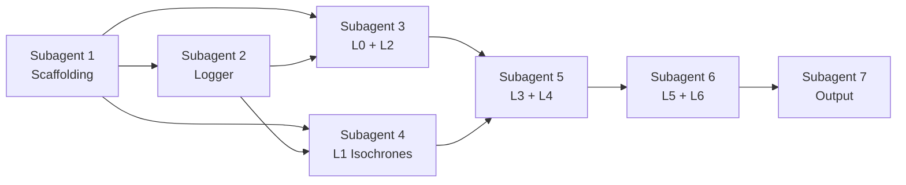

# CatchmentIQ — Complete Implementation Blueprint

> **Purpose:** This document is a self-contained specification for building the entire CatchmentIQ pipeline. It includes architecture, theory, data schemas, implementation details, config formats, logger module design, and output structure. An AI coding agent should be able to read this document and build the complete system.

---

## Project Overview

**Client:** Rancho Labs — a robotics and coding education company for HNI families (₹40+ LPA household income). Currently operating in Delhi/Noida, expanding to other cities.

**Problem:** Given a new city, where should Rancho Labs open their next learning centre to maximize proximity to their target audience?

**Solution:** CatchmentIQ — a probabilistic Spatial Decision Support System (SDSS) that uses school data and real estate listings as proxies for affluent family locations. It produces interactive heatmaps showing where the Total Addressable Market (TAM) lives, validated against Points of Interest.

**Core Insight:** Instead of unreliable census income data, we use two proxies:
1. **Schools** — families with children attend schools. School fee levels correlate with family income.
2. **Real Estate** — property price is the strongest available proxy for household wealth in Indian cities.

The system intersects these two proxy layers using a gravity model to probabilistically distribute known student populations across habitable city hexes.

---

## Tech Stack

| Component | Technology | Why |
|-----------|-----------|-----|
| Language | Python 3.11+ | Geospatial ecosystem (shapely, geopandas, h3) |
| Isochrone Engine | OSRM (self-hosted via Docker) | Free, unlimited, fast. No API costs. |
| Hex Grid | Uber H3 (h3-py) | Industry standard for spatial indexing |
| Geo Operations | GeoPandas + Shapely | Polygon operations, spatial joins |
| Map Rendering | Leaflet.js (logger), Folium/Kepler.gl (output) | Lightweight, no build step |
| Live Logger | Flask + flask-sock + WebSocket | Real-time pipeline visualization |
| POI Data | Google Places API (or Overpass/OSM as fallback) | Best Indian POI coverage |
| Config | YAML files | Human-readable, easy to edit |
| Output | HTML map + CSV + GeoJSON + PDF | Multi-audience deliverables |

### Python Dependencies

```
geopandas>=0.14
shapely>=2.0
h3>=4.0
pandas>=2.0
numpy>=1.24
folium>=0.15
flask>=3.0
flask-sock>=0.7
requests>=2.31
osmnx>=1.7          # For city boundary + road network
pyyaml>=6.0
chroma-py>=0.1      # Color scales
reportlab>=4.0      # PDF generation
scipy>=1.11         # Spatial statistics
```

---

## Project Structure

```
catchmentiq/
├── config/
│   ├── city_bangalore.yaml        # City-specific config
│   ├── income_tiers.yaml          # Income → school fee → property price mappings
│   └── poi_categories.yaml        # POI categories per income tier
│
├── data/
│   ├── raw/
│   │   ├── schools.json           # Scraped school data
│   │   └── magicbricks.json       # Scraped real estate data
│   ├── processed/                 # Intermediate outputs (cached)
│   │   ├── h3_grid_masked.parquet
│   │   ├── isochrones.parquet
│   │   └── re_surface.parquet
│   └── boundaries/
│       └── bangalore_wards.geojson  # Ward boundaries (from BBMP/OSM)
│
├── layers/
│   ├── __init__.py
│   ├── layer0_ingest.py           # Data loading + cleaning
│   ├── layer1_isochrones.py       # OSRM isochrone computation
│   ├── layer2_grid.py             # H3 grid + habitability masking
│   ├── layer3_realestate.py       # Real estate surface
│   ├── layer4_gravity.py          # Huff gravity model
│   ├── layer5_scoring.py          # Percentile scoring + stability
│   └── layer6_validation.py       # POI validation + ward proximity
│
├── logger/
│   ├── __init__.py
│   ├── live_logger.py             # LiveLogger class
│   ├── server.py                  # Flask + WebSocket server
│   └── templates/
│       └── dashboard.html         # Single-file dashboard
│
├── output/
│   ├── generator.py               # Output bundle generator
│   └── pdf_report.py              # PDF summary generator
│
├── utils/
│   ├── geo_helpers.py             # GeoJSON conversion, simplification
│   ├── h3_helpers.py              # H3 utility functions
│   └── osrm_client.py             # OSRM API wrapper
│
├── main.py                        # Pipeline orchestrator
└── requirements.txt
```

---

## Data Schemas

### School Data (Input)

Source: Scraped from ezyschooling.com. JSON array of objects.

```json
{
    "School Name": "Stonehill International School",
    "Board": "IB, IGCSE",
    "URL": "https://ezyschooling.com/school/...",
    "Student-Teacher Ratio": "7:1",
    "Teacher Count": "NA",
    "Computed Student Count": 677.8,
    "Is Student Count Estimated": "Yes",
    "Average Fee (Annual)": 1391256.69,
    "Is Fee Estimated": "No",
    "Starting Class": "UKG",
    "Ending Class": "12 Class",
    "Address": "NA",
    "Pincode": "NA",
    "Latitude": 13.171083,
    "Longitude": 77.596280
}
```

**Data Quality Notes (handle in Layer 0):**
- `Student-Teacher Ratio` is a string like "7:1" — parse to extract ratio as float
- `Computed Student Count` can be fractional (estimated) — round to int
- `Teacher Count` can be "NA" — treat as null
- `Average Fee (Annual)` is in INR — this is the primary filter for income tier mapping
- `Latitude`/`Longitude` — validate: must fall within city bounding box
- `Board` can be comma-separated ("IB, IGCSE") — split into list for filtering
- Some schools may have `Is Fee Estimated: "Yes"` — flag these with lower confidence but still use them

### Real Estate Data (Input)

Source: Scraped from MagicBricks. JSON array of objects.

```json
{
    "listing_id": "83954143",
    "listing_url": "...",
    "city": "Bangalore",
    "locality": 79505,
    "latitude": 12.9114311,
    "longitude": 77.6445763,
    "project_name": null,
    "landmark": "HSR Layout Police Station",
    "transaction_type": "Rent",
    "price_inr": 25000,
    "price_per_sqft": 42,
    "maintenance_inr": 0,
    "booking_amount": 15000,
    "property_category": "20292",
    "property_type": "Builder Floor Apartment",
    "bhk_count": 11700,
    "bathroom_count": 1,
    "furnishing_status": "Semi-Furnished",
    "ownership_type": null,
    "carpet_area": 550,
    "carpet_area_unit": "Sq-ft",
    "covered_area": 600,
    "possession_status": "Immediately",
    "age_of_property": null,
    "floor_number": 3,
    "total_floors": 4,
    "listed_by": "Agent",
    "posted_date": "2026-04-12",
    "has_rera": null,
    "amenities_list": ["12201", "12202", "12205", "12209", "12218"],
    "luxury_amenities": null,
    "confidence_score": 56,
    "is_luxury": false,
    "is_prime_location": true,
    "tenant_preference": "Bachelors"
}
```

**Data Quality Notes (CRITICAL — handle in Layer 0):**

| Field | Issue | Fix |
|-------|-------|-----|
| `bhk_count` | Contains values like `11700` — this is clearly a scraping artifact, not a real BHK count | **Map known codes to actual BHK**: `11700` → 1 BHK, `11701` → 2 BHK, `11702` → 3 BHK, `11703` → 4 BHK, `11704` → 5+ BHK. If the pattern isn't consistent, use `covered_area` as a proxy: <600 sqft → 1BHK, 600-1000 → 2BHK, 1000-1500 → 3BHK, 1500-2200 → 4BHK, >2200 → 5+BHK. |
| `locality` | Numeric code (e.g., `79505`), not a locality name | Use for grouping/dedup only. The actual spatial position comes from lat/lon. Don't try to reverse-map these codes. |
| `property_category` | Numeric code (e.g., `20292`) | Similarly, use `property_type` string instead. |
| `amenities_list` | Numeric codes, not names | Don't use for the core model. Only use if you build an amenity-based luxury scoring layer later. |
| `transaction_type` | "Rent" vs "Sale" | **Split into two datasets.** Rental listings and sale listings have different price semantics. A ₹25,000/month rent ≠ a ₹25,000 property price. Filter and map separately per income tier config. |
| `price_inr` | Meaning changes based on `transaction_type` | For Rent: monthly rent in INR. For Sale: total property price in INR. Handle accordingly. |
| `confidence_score` | MagicBricks internal score (0-100) | Use as a quality weight — higher confidence listings get slightly more weight in the capacity mass. |
| `is_luxury`, `is_prime_location` | Boolean flags from MagicBricks | Useful secondary signals. `is_luxury: true` can boost weight for the ₹40 LPA tier. |
| `posted_date` | Date string | Filter out listings older than 12 months — they may no longer reflect current market. |

### Real Estate Handling Strategy (Given Constraints)

Since you can only use MagicBricks data, here's how to extract maximum signal:

**Step 1: Split by transaction type**
```python
sale_listings = [l for l in listings if l["transaction_type"] == "Sale"]
rent_listings = [l for l in listings if l["transaction_type"] == "Rent"]
```

**Step 2: Income tier filtering**

The config file maps income tiers to both sale and rent price ranges:

```yaml
# income_tiers.yaml
tiers:
  premium_40lpa:
    label: "₹40 LPA+"
    school_fee_min: 200000        # ₹2L/year minimum school fee
    school_boards: ["IB", "IGCSE", "ICSE"]  # Preferred boards
    realestate:
      sale:
        price_min: 15000000       # ₹1.5 Cr
        price_max: null           # No upper limit
        bhk_min: 3
      rent:
        price_min: 50000          # ₹50k/month
        price_max: null
        bhk_min: 3
    poi_categories:               # For Layer 6 validation
      - luxury_auto_dealer
      - international_school
      - premium_supermarket
      - premium_gym
      - fine_dining

  midmarket_12lpa:
    label: "₹12-25 LPA"
    school_fee_min: 60000         # ₹60k/year
    school_fee_max: 200000        # ₹2L/year
    school_boards: ["CBSE", "ICSE", "State"]
    realestate:
      sale:
        price_min: 6000000        # ₹60L
        price_max: 15000000       # ₹1.5 Cr
        bhk_min: 2
      rent:
        price_min: 20000          # ₹20k/month
        price_max: 50000          # ₹50k/month
        bhk_min: 2
    poi_categories:
      - dmart
      - reliance_smart
      - mid_tier_gym
      - coaching_centre
```

**Step 3: Compute unified capacity mass per hex**

Both sale and rent listings that survive the filter contribute to a hex's capacity mass. But weight them differently:

```
Capacity_Mass(hex) = (count_sale_listings × 1.0) + (count_rent_listings × 0.7)
```

Rationale: Sale listings indicate permanent residents (more likely to enroll in year-long courses). Rent listings indicate potentially transient families (slightly lower weight). The 0.7 factor is configurable.

**Step 4: Deduplication by location cluster**

Multiple listings at the same lat/lon (same building) should count as one data point with a higher mass, not N independent points:

```python
# Group by H3 hex at resolution 10 (very fine ~65m)
# Within each res-10 hex, count unique listing_ids
# This prevents a single building with 50 listings from dominating
```

**Step 5: Quality weighting**

Use MagicBricks' own `confidence_score`:
```
Weighted_Mass(hex) = Capacity_Mass(hex) × avg(confidence_score) / 100
```

---

## Config Schemas

### City Config

```yaml
# config/city_bangalore.yaml
city:
  name: "Bangalore"
  osm_relation_id: 4479470          # For downloading boundary from OSM
  center: [12.9716, 77.5946]
  zoom: 11
  bounding_box:                      # Lat/Lon bounds for data validation
    min_lat: 12.7
    max_lat: 13.25
    min_lon: 77.35
    max_lon: 77.85

grid:
  h3_resolution: 8                   # ~460m hex edge. Good for city-level.
  mask_sources:                      # What to mask out as uninhabitable
    - water                          # Lakes, rivers
    - industrial                     # Industrial zones
    - military                       # Cantonment areas

isochrones:
  engine: "osrm"                     # "osrm" or "traveltime"
  osrm_url: "http://localhost:5000"  # Self-hosted OSRM
  bands_minutes: [10, 20, 30]        # 3 bands. NOT 4. Drop 45-60 min.
  profile: "car"                     # Driving mode
  time_of_day: "peak"               # Use peak hour travel times

gravity_model:
  alpha: 1.0                         # Mass exponent (Wealth Sensitivity)
  beta: 2.0                          # Distance friction (Commute Sensitivity)
  alpha_presets:                     # Human-readable labels for UI
    low: 0.7
    medium: 1.0
    high: 1.5
  beta_presets:
    low: 1.5
    medium: 2.0
    high: 2.5

smoothing:
  method: "conditional_kring"        # Only smooth into hexes with SOME listings
  k_ring_radius: 1                   # Immediate neighbors only

stability:
  num_runs: 3                        # 3-run stability check (NOT Monte Carlo 1000)
  alpha_jitter: 0.3
  beta_jitter: 0.5

realestate:
  sale_weight: 1.0                   # Weight for sale listings in capacity mass
  rent_weight: 0.7                   # Weight for rent listings
  max_listing_age_days: 365          # Ignore listings older than 1 year
  use_confidence_score: true         # Weight by MagicBricks confidence

output:
  formats: ["html", "csv", "geojson", "pdf"]
  top_n_zones: 20                    # How many top hexes to highlight
```

### POI Categories Config

```yaml
# config/poi_categories.yaml
#
# For each income tier, define the POI categories to query from Google Places API.
# These are used in Layer 6 for validation and ward-proximity scoring.

premium_40lpa:
  - category: "luxury_auto_dealer"
    google_type: "car_dealer"
    keywords: ["BMW", "Mercedes", "Audi", "Jaguar", "Porsche", "Lexus"]
    weight: 1.5                    # Higher weight = stronger validation signal

  - category: "international_school"
    google_type: "school"
    keywords: ["international", "IB", "IGCSE", "global"]
    weight: 1.2

  - category: "premium_supermarket"
    google_type: "supermarket"
    keywords: ["Nature's Basket", "Foodhall", "Le Marche", "Godrej Nature's"]
    weight: 1.0

  - category: "premium_gym"
    google_type: "gym"
    keywords: ["Gold's Gym", "Cult.fit", "Anytime Fitness", "F45"]
    weight: 0.8

  - category: "fine_dining"
    google_type: "restaurant"
    keywords: ["fine dining", "premium"]
    price_level_min: 3             # Google Places price_level 3-4
    weight: 0.7

midmarket_12lpa:
  - category: "value_retail"
    google_type: "supermarket"
    keywords: ["DMart", "Reliance Smart", "Big Bazaar", "More Supermarket"]
    weight: 1.0

  - category: "coaching_centre"
    google_type: "school"
    keywords: ["coaching", "tuition", "BYJU'S", "Kumon"]
    weight: 1.2

  - category: "mid_tier_gym"
    google_type: "gym"
    keywords: ["gym", "fitness"]
    price_level_max: 2
    weight: 0.8
```

---

## Layer-by-Layer Implementation

---

### LAYER 0: Data Ingest & Cleaning

**File:** `layers/layer0_ingest.py`

**Theory:** Garbage in, garbage out. This layer is pure data engineering — load, validate, clean, and standardize both datasets before any spatial computation begins.

**Input:** Raw JSON files from `data/raw/`
**Output:** Cleaned GeoDataFrames (in-memory), cached to `data/processed/` as Parquet

**Implementation:**

```python
def run_layer0(config: dict, logger: LiveLogger) -> tuple[gpd.GeoDataFrame, gpd.GeoDataFrame]:
    """
    Returns:
        schools_gdf: GeoDataFrame with columns:
            - name, board (list), student_count (int), avg_fee (float),
            - fee_is_estimated (bool), student_count_is_estimated (bool),
            - starting_class, ending_class, geometry (Point)

        realestate_gdf: GeoDataFrame with columns:
            - listing_id, transaction_type, price_inr, bhk (int, corrected),
            - covered_area, property_type, furnishing_status, is_luxury,
            - is_prime_location, confidence_score, posted_date, geometry (Point)
    """
```

**School Cleaning Steps:**
1. Load JSON → DataFrame
2. Parse `Student-Teacher Ratio` string "7:1" → float `7.0`
3. Round `Computed Student Count` to int
4. Split `Board` string "IB, IGCSE" → list `["IB", "IGCSE"]`
5. Validate lat/lon within city bounding box (drop outliers)
6. Drop schools with null lat/lon
7. Convert to GeoDataFrame with Point geometry

**Real Estate Cleaning Steps:**
1. Load JSON → DataFrame
2. **BHK Correction (CRITICAL):** The `bhk_count` field contains codes, not actual BHK numbers.
   ```python
   # Attempt code-based mapping first
   BHK_CODE_MAP = {11700: 1, 11701: 2, 11702: 3, 11703: 4, 11704: 5}
   # If a value doesn't match known codes, fall back to area-based inference:
   def infer_bhk_from_area(covered_area):
       if covered_area < 600: return 1
       elif covered_area < 1000: return 2
       elif covered_area < 1500: return 3
       elif covered_area < 2200: return 4
       else: return 5
   ```
3. Filter out listings older than `config.realestate.max_listing_age_days`
4. Split into `sale_df` and `rent_df` by `transaction_type`
5. Validate lat/lon within city bounding box
6. Drop duplicates by `listing_id`
7. Convert to GeoDataFrame with Point geometry
8. Add column `data_source = "magicbricks"` (for future extensibility)

**Logger Calls:**
```python
logger.layer_start(0, "Data Ingest & Cleaning")
logger.log(f"Loaded {len(schools)} schools, {invalid_schools} dropped (bad coords)")
logger.add_points("Schools", schools_geojson, style={"color": "#FF6B35", "radius": 5,
    "popup_fields": ["name", "board", "avg_fee", "student_count"]})
logger.log(f"Loaded {len(listings)} RE listings ({len(sale_df)} sale, {len(rent_df)} rent)")
logger.log(f"BHK correction applied: {corrected_count} values remapped")
logger.add_points("Real Estate", re_geojson, style={"color": "#3498DB", "radius": 3,
    "popup_fields": ["price_inr", "bhk", "property_type", "transaction_type"]})
logger.layer_end(0, f"{len(schools)} schools, {len(listings)} listings ready")
```

---

### LAYER 1: School Catchments (Isochrones)

**File:** `layers/layer1_isochrones.py`

**Theory:** A school's influence isn't a simple radius circle — it follows the road network. A school next to a highway can "pull" students from 15 km away, while one surrounded by narrow lanes might only reach 3 km. We compute drive-time isochrones (equi-time polygons) that represent realistic travel zones.

We use **banded isochrones** because willingness to travel decays gradually. A family 8 minutes away is far more likely to attend than one 25 minutes away. By splitting the isochrone into bands (0-10, 10-20, 20-30 min), we can assign different decay weights downstream in the gravity model.

**Input:**
- `schools_gdf` from Layer 0
- Income tier config (to filter schools by fee range)
- OSRM server URL

**Output:**
- `isochrones_gdf`: GeoDataFrame with columns:
  - `school_name`, `school_id`, `band` ("0-10", "10-20", "20-30"),
  - `band_midpoint_minutes` (5, 15, 25), `geometry` (Polygon)

**School Filtering:**
Before computing isochrones, filter schools to the selected income tier:
```python
tier = config["income_tiers"]["premium_40lpa"]
filtered_schools = schools_gdf[
    (schools_gdf["avg_fee"] >= tier["school_fee_min"]) &
    (schools_gdf["board"].apply(lambda boards: any(b in tier["school_boards"] for b in boards)))
]
```
For the ₹40 LPA tier, this keeps IB/IGCSE/ICSE schools with fees ≥ ₹2L/year. CBSE schools charging ₹40k/year are excluded.

**OSRM Isochrone Computation:**

```python
# utils/osrm_client.py

def get_isochrone(lat: float, lon: float, time_minutes: int,
                   osrm_url: str, profile: str = "car") -> Polygon:
    """
    Compute a single isochrone polygon using OSRM's table service +
    concave hull approach:

    1. Generate a grid of sample points around the school (e.g., 36 points
       at cardinal directions, every 10 degrees, at estimated max radius)
    2. Use OSRM /table/v1 to get drive times from school to all sample points
    3. Filter points reachable within time_minutes
    4. Compute concave hull of reachable points → isochrone polygon

    Alternative: Use OSRM /isochrone endpoint if available (requires
    osrm-isochrone plugin). If not, use the Valhalla /isochrone endpoint
    as a drop-in replacement.
    """
```

**Banding Logic:**
```python
def compute_banded_isochrones(school, bands=[10, 20, 30], osrm_url="..."):
    """
    Returns list of band polygons by subtracting inner from outer:
    - Band 0-10: isochrone(10)
    - Band 10-20: isochrone(20) - isochrone(10)
    - Band 20-30: isochrone(30) - isochrone(20)
    """
    polygons = {}
    prev_poly = None
    for minutes in bands:
        full_poly = get_isochrone(school.lat, school.lon, minutes, osrm_url)
        if prev_poly:
            band_poly = full_poly.difference(prev_poly)
        else:
            band_poly = full_poly
        polygons[f"0-{minutes}" if not prev_poly else f"{bands[bands.index(minutes)-1]}-{minutes}"] = band_poly
        prev_poly = full_poly
    return polygons
```

**Caching:** Isochrone computation is expensive. Cache results to `data/processed/isochrones.parquet`. Only recompute if the school dataset changes.

**Performance Note:** For 500+ schools × 3 bands = 1,500+ isochrone computations. At ~0.5s per isochrone on local OSRM, this is ~12 minutes. Use Python `concurrent.futures.ThreadPoolExecutor` with 4-8 workers to parallelize. Log progress every 50 schools.

**Logger Calls:**
```python
logger.layer_start(1, "School Catchments (Isochrones)")
logger.log(f"Filtered to {len(filtered)} schools for income tier: {tier_name}")
logger.log(f"Computing 3-band isochrones via OSRM at {osrm_url}")

# As each school completes, add its isochrone bands to the map
BAND_STYLES = {
    "0-10":  {"fill_color": "#27AE60", "fill_opacity": 0.25, "stroke_width": 0.5},
    "10-20": {"fill_color": "#F39C12", "fill_opacity": 0.15, "stroke_width": 0.5},
    "20-30": {"fill_color": "#E74C3C", "fill_opacity": 0.08, "stroke_width": 0.5},
}
for band_name, polygon in bands.items():
    logger.add_polygons(f"Isochrones {band_name}", geojson, style=BAND_STYLES[band_name])

logger.layer_end(1, f"{len(filtered)} schools × 3 bands = {total_polys} isochrone polygons")
```

---

### LAYER 2: H3 Grid & Habitability Masking

**File:** `layers/layer2_grid.py`

**Theory:** Continuous polygons can't hold discrete mathematical weights. We pixelate the city into Uber's H3 hexagonal grid — hexagons are preferred over squares because they have uniform adjacency (6 neighbors, all equidistant) and no edge/corner ambiguity.

We then mask out uninhabitable areas (lakes, rivers, industrial zones, military cantonment) so the gravity model doesn't assign families to places where nobody can live.

**Input:**
- City boundary polygon (from OSM via `osmnx.geocode_to_gdf`)
- Overture Maps or OSM land-use data

**Output:**
- `grid_gdf`: GeoDataFrame with columns:
  - `hex_id` (H3 index string), `is_habitable` (bool), `geometry` (Polygon)

**Implementation:**

```python
def generate_city_grid(city_boundary: Polygon, resolution: int = 8) -> gpd.GeoDataFrame:
    """
    1. Use h3.polyfill_geojson(city_boundary, resolution) to fill the city with hexes
    2. Convert each hex_id to its boundary polygon
    3. Returns GeoDataFrame of all hexes within city limits
    """

def apply_habitability_mask(grid_gdf, mask_sources: list) -> gpd.GeoDataFrame:
    """
    1. Download land-use polygons from OSM (via osmnx or Overpass API):
       - natural=water → lakes, rivers
       - landuse=industrial → industrial zones
       - landuse=military → cantonment
    2. For each hex, check intersection with mask polygons
    3. If hex centroid falls inside a mask polygon → is_habitable = False
    4. Simple binary mask. No fractional ratios.
    """
```

**Why Binary Mask (Not Fractional):**
A hex that's 80% lake and 20% land could theoretically house families on the 20% land strip. But at H3 resolution 8 (~460m), that 20% is too small to meaningfully contribute. Binary masking is simpler, faster, and doesn't create false precision.

**Caching:** This is a one-time computation per city. Cache to `data/processed/h3_grid_masked.parquet`. Never recompute unless switching cities.

**Logger Calls:**
```python
logger.layer_start(2, "H3 Grid & Habitability Masking")
logger.log(f"Generated {total_hexes} hexes at H3 resolution {res}")
logger.add_polygons("H3 Grid", grid_geojson, style={
    "fill_color": "#2C3E50", "fill_opacity": 0.05, "stroke_color": "#34495E", "stroke_width": 0.5
})
logger.log(f"Masking uninhabitable areas: {mask_sources}")
logger.add_polygons("Masked Areas", masked_geojson, style={
    "fill_color": "#E74C3C", "fill_opacity": 0.35
})
logger.log(f"Active hexes: {active}/{total} ({pct:.1f}% habitable)")
logger.layer_end(2, f"{active} habitable hexes, {masked} masked out")
```

---

### LAYER 3: Real Estate Capacity Surface

**File:** `layers/layer3_realestate.py`

**Theory:** This layer transforms scattered real estate listings into a continuous "wealth surface" across the city grid. Each hex gets a capacity mass score representing how many affluent families could plausibly live there, based on the volume and quality of matching real estate.

**Input:**
- `realestate_gdf` from Layer 0
- `grid_gdf` from Layer 2
- Income tier config (price/BHK filters)

**Output:**
- `grid_gdf` with added column: `capacity_mass` (float)

**Implementation Steps:**

```python
def compute_realestate_surface(re_gdf, grid_gdf, tier_config, re_config):
    """
    Step 1: Filter listings by income tier
    """
    sale_filtered = re_gdf[
        (re_gdf["transaction_type"] == "Sale") &
        (re_gdf["price_inr"] >= tier_config["realestate"]["sale"]["price_min"]) &
        (re_gdf["bhk"] >= tier_config["realestate"]["sale"]["bhk_min"])
    ]
    rent_filtered = re_gdf[
        (re_gdf["transaction_type"] == "Rent") &
        (re_gdf["price_inr"] >= tier_config["realestate"]["rent"]["price_min"]) &
        (re_gdf["bhk"] >= tier_config["realestate"]["rent"]["bhk_min"])
    ]
    # Apply upper bounds if specified
    if tier_config["realestate"]["sale"].get("price_max"):
        sale_filtered = sale_filtered[sale_filtered["price_inr"] <= tier_config["realestate"]["sale"]["price_max"]]

    """
    Step 2: Assign each listing to its H3 hex
    """
    sale_filtered["hex_id"] = sale_filtered.apply(
        lambda r: h3.latlng_to_cell(r.geometry.y, r.geometry.x, resolution), axis=1
    )
    rent_filtered["hex_id"] = rent_filtered.apply(
        lambda r: h3.latlng_to_cell(r.geometry.y, r.geometry.x, resolution), axis=1
    )

    """
    Step 3: Aggregate capacity mass per hex
    """
    sale_mass = sale_filtered.groupby("hex_id").agg(
        sale_count=("listing_id", "count"),
        avg_confidence=("confidence_score", "mean")
    )
    rent_mass = rent_filtered.groupby("hex_id").agg(
        rent_count=("listing_id", "count"),
        avg_confidence=("confidence_score", "mean")
    )

    # Weighted mass: sale × 1.0 + rent × 0.7, scaled by avg confidence
    for hex_id in grid_gdf["hex_id"]:
        s = sale_mass.loc[hex_id] if hex_id in sale_mass.index else None
        r = rent_mass.loc[hex_id] if hex_id in rent_mass.index else None
        sale_contrib = (s["sale_count"] * re_config["sale_weight"] * s["avg_confidence"] / 100) if s else 0
        rent_contrib = (r["rent_count"] * re_config["rent_weight"] * r["avg_confidence"] / 100) if r else 0
        grid_gdf.loc[grid_gdf["hex_id"] == hex_id, "capacity_mass"] = sale_contrib + rent_contrib

    """
    Step 4: Conditional k-ring smoothing
    Only spread mass to immediate neighbors that have at least SOME listings.
    This prevents wealthy hexes from bleeding mass into clearly non-residential areas.
    """
    for hex_id in grid_gdf[grid_gdf["capacity_mass"] > 0]["hex_id"]:
        neighbors = h3.grid_ring(hex_id, 1)  # Immediate ring only
        for neighbor in neighbors:
            if neighbor in grid_gdf["hex_id"].values:
                neighbor_mass = grid_gdf.loc[grid_gdf["hex_id"] == neighbor, "capacity_mass"].values[0]
                if neighbor_mass > 0:  # CONDITIONAL: only smooth into non-empty hexes
                    # Add 20% of current hex's mass to neighbor
                    grid_gdf.loc[grid_gdf["hex_id"] == neighbor, "capacity_mass"] += \
                        grid_gdf.loc[grid_gdf["hex_id"] == hex_id, "capacity_mass"].values[0] * 0.2

    return grid_gdf
```

**Logger Calls:**
```python
logger.layer_start(3, "Real Estate Capacity Surface")
logger.log(f"Income tier: {tier_name}")
logger.log(f"Sale filter: price ≥ ₹{sale_min:,.0f}, BHK ≥ {bhk_min}")
logger.log(f"Rent filter: price ≥ ₹{rent_min:,.0f}/mo, BHK ≥ {bhk_min}")
logger.log(f"Survived filter: {len(sale_filtered)} sale + {len(rent_filtered)} rent = {total_filtered} listings")
logger.clear_layer("Real Estate")  # Remove raw dots
logger.add_points("RE (Filtered)", filtered_geojson, style={"color": "#9B59B6", "radius": 4})
logger.add_choropleth("Capacity Mass", hex_mass_geojson, value_field="capacity_mass", color_scale="Purples")
logger.layer_end(3, f"Capacity surface: {nonzero_hexes} hexes with mass, {total_filtered} listings used")
```

---

### LAYER 4: Gravity Model (Huff Apportionment)

**File:** `layers/layer4_gravity.py`

**Theory:** The Huff Gravity Model is a spatial interaction model that probabilistically distributes a known quantity (school student counts) across space, weighted by two factors:
1. **Attractiveness** of each hex (real estate mass = wealth proxy)
2. **Distance friction** (how far the hex is from the school)

The intuition: If School X has 500 students, those students live *somewhere*. The gravity model says they're more likely to live in wealthy nearby hexes than in poor distant hexes. By computing this for all schools simultaneously, overlapping catchments naturally sum, revealing true demand hotspots.

**The Math:**

For every hex ($i$) inside school ($j$)'s isochrone catchment:

$$S_{ij} = \frac{M_i^{\alpha}}{D_{ij}^{\beta}}$$

Where:
- $M_i$ = Capacity mass of hex $i$ (from Layer 3)
- $D_{ij}$ = Drive time in minutes from hex $i$ to school $j$ (band midpoint: 5, 15, or 25 minutes)
- $\alpha$ = Wealth sensitivity exponent (default 1.0). Higher → more weight on wealthy hexes.
- $\beta$ = Distance friction exponent (default 2.0). Higher → sharper distance decay.

**Apportionment:**

School $j$'s total students are divided proportionally:

$$\text{Students}_{ij} = \text{TotalStudents}_j \times \frac{S_{ij}}{\sum_{k \in \text{catchment}} S_{kj}}$$

Where the sum is over all habitable hexes within school $j$'s isochrone bands.

**Overlap Handling:** When multiple schools' catchments overlap the same hex, the apportioned students simply sum:

$$\text{TAM}_i = \sum_{j} \text{Students}_{ij}$$

This is correct — it represents the total estimated student population living in that hex, coming from multiple feeder schools.

**Capacity Cap:**
A school with `student_count = 500` cannot distribute more than 500 students total. This is automatically enforced by the proportional apportionment formula (the fractions sum to 1.0).

**Implementation:**

```python
def run_gravity_model(schools_gdf, isochrones_gdf, grid_gdf, config, logger):
    """
    For each school:
        1. Find all habitable hexes that fall within its isochrone bands
        2. For each hex, look up: capacity_mass (Layer 3), band midpoint (Layer 1)
        3. Compute S_ij for each hex
        4. Normalize: fraction_ij = S_ij / sum(S_kj for all k in catchment)
        5. Apportion: students_ij = school.student_count * fraction_ij
        6. Add students_ij to hex i's running total

    Returns grid_gdf with added column: apportioned_students (float)
    """
    alpha = config["gravity_model"]["alpha"]
    beta = config["gravity_model"]["beta"]

    grid_gdf["apportioned_students"] = 0.0

    for idx, school in schools_gdf.iterrows():
        # Get this school's isochrone bands
        school_isos = isochrones_gdf[isochrones_gdf["school_id"] == school["name"]]

        # Find hexes inside each band using spatial join
        catchment_hexes = []
        for _, band_row in school_isos.iterrows():
            band_polygon = band_row.geometry
            band_midpoint = band_row["band_midpoint_minutes"]  # 5, 15, or 25

            # Spatial join: which hex centroids fall inside this band polygon?
            hexes_in_band = grid_gdf[
                grid_gdf["is_habitable"] &
                grid_gdf.geometry.centroid.within(band_polygon)
            ].copy()
            hexes_in_band["drive_time"] = band_midpoint
            catchment_hexes.append(hexes_in_band)

        if not catchment_hexes:
            continue

        catchment = pd.concat(catchment_hexes)

        # If a hex appears in multiple bands (shouldn't, but safety), keep shortest drive time
        catchment = catchment.sort_values("drive_time").drop_duplicates(subset="hex_id", keep="first")

        # Compute suitability scores
        catchment["S_ij"] = (
            (catchment["capacity_mass"] ** alpha) /
            (catchment["drive_time"] ** beta)
        )

        # Handle edge case: all S_ij = 0 (no capacity mass in catchment)
        total_S = catchment["S_ij"].sum()
        if total_S == 0:
            logger.log(f"Warning: {school['name']} has zero capacity mass in catchment", level="warning")
            continue

        # Apportion
        catchment["fraction"] = catchment["S_ij"] / total_S
        catchment["students_from_this_school"] = school["student_count"] * catchment["fraction"]

        # Add to running total
        for _, hex_row in catchment.iterrows():
            grid_gdf.loc[
                grid_gdf["hex_id"] == hex_row["hex_id"],
                "apportioned_students"
            ] += hex_row["students_from_this_school"]

    return grid_gdf
```

**Logger Calls:**
```python
logger.layer_start(4, "Gravity Model (Huff Apportionment)")
logger.log(f"Parameters: α = {alpha} (Wealth Sensitivity), β = {beta} (Commute Sensitivity)")
logger.log(f"Processing {len(schools)} schools × {len(active_hexes)} active hexes")

# Update choropleth every 25 schools to show progressive "heating"
if idx % 25 == 0:
    logger.add_choropleth("TAM Density", partial_geojson,
        value_field="apportioned_students", color_scale="YlOrRd")
    logger.log(f"Gravity model: {idx}/{len(schools)} schools processed")

logger.layer_end(4, f"Total apportioned: {total_students:,.0f} students across {nonzero_hexes} hexes")
```

---

### LAYER 5: Scoring & Stability

**File:** `layers/layer5_scoring.py`

**Theory:** Raw student counts are hard to interpret on a map. 200 students in hex A vs 150 in hex B — is that a meaningful difference? Percentile scoring normalizes the values so you can instantly see which hexes are in the top 5%, top 10%, etc.

The stability check ensures that the top-scoring hexes aren't artifacts of specific α/β choices. If the same hexes dominate under slightly different parameters, they're robust picks.

**Input:**
- `grid_gdf` with `apportioned_students` from Layer 4
- Stability config

**Output:**
- `grid_gdf` with added columns:
  - `percentile_score` (0-100)
  - `absolute_tam` (int, rounded apportioned_students)
  - `stability_flag` ("Stable" or "Sensitive")

**Implementation:**

```python
def score_and_stabilize(grid_gdf, schools_gdf, isochrones_gdf, config, logger):
    # ---- Percentile Scoring ----
    # Only score habitable hexes with non-zero TAM
    active = grid_gdf[grid_gdf["apportioned_students"] > 0].copy()
    active["percentile_score"] = active["apportioned_students"].rank(pct=True) * 100
    active["absolute_tam"] = active["apportioned_students"].round().astype(int)

    # ---- 3-Run Stability Check ----
    # Run gravity model 3 times with jittered parameters
    base_alpha = config["gravity_model"]["alpha"]
    base_beta = config["gravity_model"]["beta"]
    jitter_alpha = config["stability"]["alpha_jitter"]    # 0.3
    jitter_beta = config["stability"]["beta_jitter"]      # 0.5

    param_sets = [
        (base_alpha, base_beta),                           # Original
        (base_alpha + jitter_alpha, base_beta),            # Higher wealth sensitivity
        (base_alpha, base_beta + jitter_beta),             # Higher commute sensitivity
    ]

    top_n = config["output"]["top_n_zones"]  # 20
    top_hex_sets = []

    for alpha, beta in param_sets:
        result = run_gravity_model(schools_gdf, isochrones_gdf, grid_gdf.copy(),
                                    {**config, "gravity_model": {"alpha": alpha, "beta": beta}},
                                    logger=None)  # Silent run, no logging
        top_hexes = set(result.nlargest(top_n, "apportioned_students")["hex_id"])
        top_hex_sets.append(top_hexes)

    # A hex is "Stable" if it appears in the top-N across ALL 3 runs
    stable_hexes = top_hex_sets[0] & top_hex_sets[1] & top_hex_sets[2]
    grid_gdf["stability_flag"] = grid_gdf["hex_id"].apply(
        lambda h: "Stable" if h in stable_hexes else "Sensitive"
    )

    return grid_gdf
```

**Logger Calls:**
```python
logger.layer_start(5, "Scoring & Stability")
logger.add_choropleth("Demand Score", scored_geojson,
    value_field="percentile_score", color_scale="YlOrRd")

top_hexes = grid_gdf[grid_gdf["percentile_score"] >= 90]
logger.add_polygons("Top 10% Zones", top_geojson, style={
    "fill_color": "#E74C3C", "fill_opacity": 0.4, "stroke_color": "#C0392B", "stroke_width": 2
})
logger.log(f"Top 10% zones: {len(top_hexes)} hexes")

logger.log(f"Running 3-run stability check...")
logger.log(f"Stable hexes in top-{top_n}: {len(stable_hexes)}/{top_n}", level="success")

logger.layer_end(5, f"Scoring complete. {len(stable_hexes)} stable top zones identified")
```

---

### LAYER 6: POI Validation & Ward Proximity

**File:** `layers/layer6_validation.py`

**Theory:** The gravity model produces a *hypothesis* about where affluent families live. POI validation tests this hypothesis against independent market signals — luxury businesses don't open in poor neighborhoods. If our high-scoring hexes also have luxury car dealers and premium supermarkets nearby, the model is validated.

**Two sub-computations:**

#### 6A. Hex-Level POI Density
For each hex, count how many relevant POIs fall within it or within its k-ring(1) neighborhood. This produces a per-hex POI density score.

#### 6B. Ward-Level POI Proximity (NEW)
Instead of only looking at whether POIs are *inside* a hex, compute how close each ward is to the *nearest* POI of each category. This captures a different signal: a ward might not contain a BMW dealer, but if one is 800m away, that's still a strong affluence indicator.

**Why Ward-Level (Not Just Hex-Level):**
- Hexes are small (~460m). A POI 500m outside a hex boundary would be missed by pure hex-density.
- Wards are administrative boundaries that executives and real-estate agents actually use. "Indiranagar Ward" is meaningful; "hex 882a91c3b3fffff" is not.
- Ward-level scoring helps bridge the gap between spatial analysis and real-world decision-making.

**Ward Boundary Data:**
Download ward boundaries from:
- BBMP ward boundaries (for Bangalore): Available as GeoJSON/Shapefile from Datameet India or OpenCity.in
- OSM administrative boundaries (admin_level=9 or 10 for ward-level)
- Store in `data/boundaries/bangalore_wards.geojson`

**Implementation:**

```python
def run_poi_validation(grid_gdf, wards_gdf, tier_config, poi_config, logger):
    """
    Part A: Hex-level POI density
    Part B: Ward-level POI proximity
    """

    # ---- Fetch POIs from Google Places API ----
    all_pois = []
    for category in poi_config:
        pois = query_google_places(
            location=city_center,
            radius=30000,  # 30km from city center
            type=category["google_type"],
            keywords=category.get("keywords", [])
        )
        for poi in pois:
            poi["category"] = category["category"]
            poi["weight"] = category["weight"]
        all_pois.extend(pois)
        logger.log(f"Fetched {len(pois)} POIs for category: {category['category']}")

    pois_gdf = gpd.GeoDataFrame(all_pois, geometry=gpd.points_from_xy(...), crs="EPSG:4326")

    # ---- Part A: Hex-Level POI Density ----
    # Assign each POI to its hex
    pois_gdf["hex_id"] = pois_gdf.apply(
        lambda r: h3.latlng_to_cell(r.geometry.y, r.geometry.x, resolution), axis=1
    )

    # For each hex, compute weighted POI count (including k-ring neighbors)
    for hex_id in grid_gdf["hex_id"]:
        neighborhood = {hex_id} | set(h3.grid_ring(hex_id, 1))
        nearby_pois = pois_gdf[pois_gdf["hex_id"].isin(neighborhood)]
        grid_gdf.loc[grid_gdf["hex_id"] == hex_id, "poi_density"] = nearby_pois["weight"].sum()

    # Validation flag: top-scoring hexes with above-median POI density = "Validated"
    median_poi = grid_gdf[grid_gdf["poi_density"] > 0]["poi_density"].median()
    grid_gdf["poi_validated"] = (
        (grid_gdf["percentile_score"] >= 90) &
        (grid_gdf["poi_density"] >= median_poi)
    )

    # ---- Part B: Ward-Level POI Proximity ----
    """
    For each ward, for each POI category, compute:
    1. Nearest distance (meters) to the closest POI of that category
    2. Count of POIs within 2km of the ward centroid
    3. Weighted proximity score

    Formula:
        Ward_POI_Score = Σ (category_weight × proximity_factor)
        where proximity_factor = max(0, 1 - (distance_km / max_distance_km))
        max_distance_km = 5 (beyond 5km, the POI has no influence)
    """

    # Project to meters for distance calculations
    wards_projected = wards_gdf.to_crs(epsg=32643)  # UTM zone 43N for Bangalore
    pois_projected = pois_gdf.to_crs(epsg=32643)

    ward_scores = []

    for ward_idx, ward in wards_gdf.iterrows():
        ward_centroid = wards_projected.loc[ward_idx].geometry.centroid
        ward_result = {
            "ward_name": ward["name"],
            "ward_id": ward_idx,
            "category_scores": {}
        }

        total_proximity_score = 0

        for category in poi_config:
            cat_name = category["category"]
            cat_weight = category["weight"]
            cat_pois = pois_projected[pois_projected["category"] == cat_name]

            if len(cat_pois) == 0:
                ward_result["category_scores"][cat_name] = {
                    "nearest_meters": None,
                    "count_within_2km": 0,
                    "proximity_factor": 0
                }
                continue

            # Distance from ward centroid to each POI in this category
            distances = cat_pois.geometry.distance(ward_centroid)
            nearest_dist = distances.min()  # meters
            count_within_2km = (distances <= 2000).sum()

            # Proximity factor: 1.0 if POI is at ward centroid, 0.0 if ≥5km away
            max_distance = 5000  # 5km
            proximity_factor = max(0, 1 - (nearest_dist / max_distance))

            weighted_score = cat_weight * proximity_factor
            total_proximity_score += weighted_score

            ward_result["category_scores"][cat_name] = {
                "nearest_meters": round(nearest_dist),
                "count_within_2km": int(count_within_2km),
                "proximity_factor": round(proximity_factor, 3)
            }

        ward_result["total_proximity_score"] = round(total_proximity_score, 3)
        ward_scores.append(ward_result)

    # Merge ward-level scores back: assign each hex the score of its containing ward
    wards_scored = wards_gdf.copy()
    wards_scored["ward_poi_score"] = [ws["total_proximity_score"] for ws in ward_scores]

    # Spatial join: assign each hex to its ward
    grid_gdf = gpd.sjoin(grid_gdf, wards_scored[["ward_name", "ward_poi_score", "geometry"]],
                          how="left", predicate="within")

    return grid_gdf, ward_scores, pois_gdf
```

**Ward Proximity Output Example:**
```json
{
    "ward_name": "Indiranagar",
    "total_proximity_score": 4.23,
    "category_scores": {
        "luxury_auto_dealer": {
            "nearest_meters": 1200,
            "count_within_2km": 3,
            "proximity_factor": 0.76
        },
        "premium_supermarket": {
            "nearest_meters": 450,
            "count_within_2km": 2,
            "proximity_factor": 0.91
        },
        "international_school": {
            "nearest_meters": 2800,
            "count_within_2km": 1,
            "proximity_factor": 0.44
        },
        "premium_gym": {
            "nearest_meters": 600,
            "count_within_2km": 4,
            "proximity_factor": 0.88
        },
        "fine_dining": {
            "nearest_meters": 300,
            "count_within_2km": 6,
            "proximity_factor": 0.94
        }
    }
}
```

**Logger Calls:**
```python
logger.layer_start(6, "POI Validation & Ward Proximity")

# Show POI points on map
logger.add_points("POIs", pois_geojson, style={
    "color": "#F1C40F", "radius": 6,
    "popup_fields": ["name", "category"]
})

# Show validated zones
logger.add_polygons("Validated ✅", validated_geojson, style={
    "fill_color": "#2ECC71", "fill_opacity": 0.3, "stroke_width": 2
})
logger.add_polygons("Unvalidated ⚠️", unvalidated_geojson, style={
    "fill_color": "#E67E22", "fill_opacity": 0.2, "stroke_width": 1
})

# Show ward proximity scores
logger.add_choropleth("Ward POI Proximity", ward_geojson,
    value_field="ward_poi_score", color_scale="BuGn")

logger.log(f"Validated: {v_count}/{total_top} top zones confirmed by POI data", level="success")
logger.log(f"Ward proximity scores computed for {len(wards)} wards")
logger.layer_end(6, f"Validation complete. {v_count} zones confirmed, ward proximity mapped")
```

---

## Output Bundle

**File:** `output/generator.py`

After all layers complete, generate the output bundle:

```
output/
├── bangalore_2026-06-07_40lpa/
│   ├── interactive_map.html        # PRIMARY deliverable
│   ├── hex_scores.csv              # For analysts
│   ├── hex_scores.geojson          # For GIS teams
│   ├── top_zones.geojson           # Top 20 hexes only
│   ├── ward_poi_proximity.json     # Ward-level POI analysis
│   ├── ward_poi_proximity.csv      # Same, tabular format
│   ├── summary_report.pdf          # Executive one-pager
│   ├── config_snapshot.yaml        # Exact parameters used
│   └── validation_summary.json     # POI validation results
```

### Interactive HTML Map (Primary Output)

Built with **Folium** (Python) or **Kepler.gl** (via `keplergl.KeplerGl`).

Features:
- Choropleth hex grid colored by demand score (YlOrRd)
- Top 20 zones highlighted with thick borders
- Toggleable layers: schools, isochrones, RE points, POIs, ward boundaries
- Click on any hex → popup with: TAM estimate, top 3 feeder schools, avg property price, POI validation flag, stability flag
- Click on any ward → popup with: ward name, ward POI proximity score, breakdown by category
- Legend with score ranges
- **Self-contained single HTML file** — no external dependencies, all CSS/JS inlined

### CSV Schema (`hex_scores.csv`)

```
hex_id, center_lat, center_lon, ward_name, percentile_score, absolute_tam,
capacity_mass, top_school_1, top_school_2, top_school_3,
avg_property_price_sale, avg_rent, poi_density, poi_validated,
ward_poi_score, stability_flag
```

### Ward POI Proximity CSV (`ward_poi_proximity.csv`)

```
ward_name, total_proximity_score, luxury_auto_nearest_m, luxury_auto_count_2km,
premium_super_nearest_m, premium_super_count_2km, intl_school_nearest_m,
intl_school_count_2km, premium_gym_nearest_m, premium_gym_count_2km,
fine_dining_nearest_m, fine_dining_count_2km
```

### PDF Report

Single-page auto-generated summary:
- Title: "CatchmentIQ Report: Bangalore — ₹40 LPA Tier"
- Static screenshot of the map (top zones highlighted)
- Table: Top 10 zones with key metrics
- Parameters used (α, β, school fee range, property filters)
- Data freshness (timestamps of input data)
- POI validation summary ("8/10 top zones validated ✅")

---

## Live Logger Module

### Architecture

```
Pipeline (Python) ──WebSocket──▶ Dashboard (Browser)
       │                              │
  LiveLogger class              Leaflet.js map
  Flask + flask-sock            + log panel
  Background thread             + progress bar
                                + layer toggles
```

### File Structure

```
logger/
├── __init__.py              # Exports: LiveLogger
├── live_logger.py           # ~150 lines
├── server.py                # ~80 lines
└── templates/
    └── dashboard.html       # ~350 lines (single file, CSS+JS inlined)
```

### LiveLogger Class API

```python
class LiveLogger:
    def __init__(self, port: int = 5050, city_center: list = [12.97, 77.59], zoom: int = 11):
        """Initialize Flask server on background thread."""

    def open(self):
        """Start server and open browser to http://localhost:{port}"""

    def log(self, message: str, level: str = "info"):
        """Send text log. Levels: debug, info, success, warning, error"""

    def layer_start(self, layer_num: int, layer_name: str):
        """Mark layer as in-progress. Update progress bar."""

    def layer_end(self, layer_num: int, summary: str):
        """Mark layer as complete. Update progress bar."""

    def add_points(self, layer_name: str, geojson: dict, style: dict = None):
        """Add point features to map. Style: color, radius, popup_fields"""

    def add_polygons(self, layer_name: str, geojson: dict, style: dict = None):
        """Add polygon features. Style: fill_color, fill_opacity, stroke_color, stroke_width"""

    def add_choropleth(self, layer_name: str, geojson: dict,
                        value_field: str, color_scale: str = "YlOrRd"):
        """Add graduated-color polygons. Color scales: YlOrRd, Purples, BuGn, etc."""

    def add_heatmap(self, layer_name: str, points: list):
        """Add heatmap layer. points = [[lat, lon, intensity], ...]"""

    def clear_layer(self, layer_name: str):
        """Remove a layer from the map."""

    def snapshot(self, filename: str):
        """Save current map state as PNG (for PDF report)."""

    def wait(self):
        """Block main thread to keep dashboard alive after pipeline finishes."""
```

### WebSocket Protocol

All messages are JSON:

```json
{"type": "log",         "timestamp": "...", "payload": {"message": "...", "level": "info"}}
{"type": "layer_start", "timestamp": "...", "payload": {"layer_num": 1, "layer_name": "...", "total_layers": 7}}
{"type": "layer_end",   "timestamp": "...", "payload": {"layer_num": 1, "summary": "..."}}
{"type": "geo_add",     "timestamp": "...", "payload": {"layer_name": "...", "render_type": "points|polygons|choropleth|heatmap", "geojson": {...}, "style": {...}}}
{"type": "geo_clear",   "timestamp": "...", "payload": {"layer_name": "..."}}
{"type": "progress",    "timestamp": "...", "payload": {"current_layer": 4, "total_layers": 7, "sub_progress": 0.65}}
```

### Dashboard HTML Layout

```
┌─────────────────────────────────────────────────────────────┐
│  CatchmentIQ · Live Pipeline Monitor      Bangalore · 40LPA │
├──────────────────────────────┬──────────────────────────────┤
│                              │  PIPELINE LOG                │
│                              │  ────────────                │
│    🗺️ INTERACTIVE MAP         │  ⬤ 13:04:01 [L0] Loading..  │
│    (Leaflet.js)              │  ✓ 13:04:03 [L0] 2,147      │
│                              │    schools loaded             │
│    70% width                 │  ● 13:04:05 [L1] Computing   │
│                              │    isochrones...              │
│                              │                              │
├──────────────────────────────┤  30% width                   │
│ LAYERS           FEATURES    │                              │
│ ☑ Schools          2,147     │                              │
│ ☑ Isochrones 0-10    847     │                              │
│ ☐ Isochrones 10-20   847     │                              │
│ ◌ H3 Grid            ---     │                              │
│ ◌ Demand Score        ---     │                              │
├──────────────────────────────┴──────────────────────────────┤
│ ████████████░░░░░░░░░░░░░░░░░░  Layer 1/7 · 14%             │
└─────────────────────────────────────────────────────────────┘
```

### Dashboard Frontend Tech

- **Leaflet.js** from CDN (map rendering)
- **chroma.js** from CDN (color interpolation for choropleth)
- **Vanilla CSS + JS** (no framework, no build step)
- All inlined in a single `dashboard.html` file

---

## Pipeline Orchestrator

**File:** `main.py`

```python
"""
CatchmentIQ — Pipeline Orchestrator

Usage:
    python main.py --city bangalore --tier premium_40lpa
    python main.py --city bangalore --tier midmarket_12lpa --alpha 1.2 --beta 2.5
"""

import argparse
import yaml
from catchmentiq.logger import LiveLogger
from catchmentiq.layers import (
    layer0_ingest,
    layer1_isochrones,
    layer2_grid,
    layer3_realestate,
    layer4_gravity,
    layer5_scoring,
    layer6_validation,
)
from catchmentiq.output import generator


def main():
    parser = argparse.ArgumentParser(description="CatchmentIQ Pipeline")
    parser.add_argument("--city", required=True, help="City config name (e.g., bangalore)")
    parser.add_argument("--tier", required=True, help="Income tier (e.g., premium_40lpa)")
    parser.add_argument("--alpha", type=float, default=None, help="Override wealth sensitivity")
    parser.add_argument("--beta", type=float, default=None, help="Override commute sensitivity")
    parser.add_argument("--no-logger", action="store_true", help="Disable live dashboard")
    parser.add_argument("--cache", action="store_true", help="Use cached intermediate results")
    args = parser.parse_args()

    # Load configs
    city_config = yaml.safe_load(open(f"config/city_{args.city}.yaml"))
    tier_config = yaml.safe_load(open("config/income_tiers.yaml"))["tiers"][args.tier]
    poi_config = yaml.safe_load(open("config/poi_categories.yaml"))[args.tier]

    # Override params if provided
    if args.alpha:
        city_config["gravity_model"]["alpha"] = args.alpha
    if args.beta:
        city_config["gravity_model"]["beta"] = args.beta

    # Initialize logger
    logger = LiveLogger(
        port=5050,
        city_center=city_config["city"]["center"],
        zoom=city_config["city"]["zoom"]
    ) if not args.no_logger else NullLogger()  # NullLogger = no-op stub

    logger.open()
    logger.log(f"CatchmentIQ Pipeline: {city_config['city']['name']} · {tier_config['label']}")

    # ═══ LAYER 0 ═══
    schools_gdf, re_gdf = layer0_ingest.run(city_config, logger)

    # ═══ LAYER 1 ═══
    isochrones_gdf = layer1_isochrones.run(schools_gdf, tier_config, city_config, logger,
                                            use_cache=args.cache)

    # ═══ LAYER 2 ═══
    grid_gdf = layer2_grid.run(city_config, logger, use_cache=args.cache)

    # ═══ LAYER 3 ═══
    grid_gdf = layer3_realestate.run(re_gdf, grid_gdf, tier_config, city_config, logger)

    # ═══ LAYER 4 ═══
    grid_gdf = layer4_gravity.run(schools_gdf, isochrones_gdf, grid_gdf, city_config, logger)

    # ═══ LAYER 5 ═══
    grid_gdf = layer5_scoring.run(grid_gdf, schools_gdf, isochrones_gdf, city_config, logger)

    # ═══ LAYER 6 ═══
    wards_gdf = gpd.read_file(f"data/boundaries/{args.city}_wards.geojson")
    grid_gdf, ward_scores, pois_gdf = layer6_validation.run(
        grid_gdf, wards_gdf, tier_config, poi_config, logger
    )

    # ═══ OUTPUT ═══
    generator.create_output_bundle(
        grid_gdf, schools_gdf, pois_gdf, ward_scores,
        city_config, tier_config, city_config
    )

    logger.log("Pipeline complete. Output bundle saved.", level="success")
    logger.wait()


if __name__ == "__main__":
    main()
```

---

## OSRM Setup (Self-Hosted)

OSRM runs as a Docker container. One-time setup per city:

```bash
# 1. Download OSM data for Karnataka (includes Bangalore)
wget https://download.geofabrik.de/asia/india/karnataka-latest.osm.pbf

# 2. Pre-process the data (takes ~5-10 min for Karnataka)
docker run -t -v $(pwd):/data osrm/osrm-backend osrm-extract -p /opt/car.lua /data/karnataka-latest.osm.pbf
docker run -t -v $(pwd):/data osrm/osrm-backend osrm-partition /data/karnataka-latest.osrm
docker run -t -v $(pwd):/data osrm/osrm-backend osrm-customize /data/karnataka-latest.osrm

# 3. Start the server (runs on port 5000)
docker run -t -i -p 5000:5000 -v $(pwd):/data osrm/osrm-backend osrm-routed --algorithm mld /data/karnataka-latest.osrm

# 4. Test it
curl "http://localhost:5000/table/v1/driving/77.5946,12.9716;77.6100,12.9800?annotations=duration"
```

This gives you unlimited, free, fast isochrone computation. No API keys, no rate limits, no costs.

---

## Subagent Task Breakdown

When building this in an AI IDE, the work should be split into these independent subagents/tasks:

### Subagent 1: Project Scaffolding
- Create directory structure
- Create `requirements.txt`
- Create all config YAML files (`city_bangalore.yaml`, `income_tiers.yaml`, `poi_categories.yaml`)
- Create `main.py` orchestrator skeleton
- Create `utils/geo_helpers.py` and `utils/h3_helpers.py` with helper functions

### Subagent 2: Logger Module
- Build `logger/live_logger.py` — the LiveLogger class
- Build `logger/server.py` — Flask + WebSocket server
- Build `logger/templates/dashboard.html` — the full dashboard frontend
- Test: run a fake pipeline that emits dummy data and verify the dashboard renders

### Subagent 3: Layer 0 + Layer 2 (Data Ingest + Grid)
- Build `layers/layer0_ingest.py` — school and RE data loading/cleaning
- Build `layers/layer2_grid.py` — H3 grid generation + habitability masking
- These are independent of each other but both are "infrastructure" layers
- Test: load real data, verify GeoDataFrames, check coordinates on map

### Subagent 4: Layer 1 (Isochrones)
- Build `utils/osrm_client.py` — OSRM API wrapper
- Build `layers/layer1_isochrones.py` — banded isochrone computation
- This depends on Layer 0 (needs school locations)
- Test: compute isochrones for 5 schools, verify polygon shapes on map

### Subagent 5: Layer 3 + Layer 4 (Real Estate + Gravity)
- Build `layers/layer3_realestate.py` — RE surface with BHK correction, filtering, smoothing
- Build `layers/layer4_gravity.py` — Huff gravity model
- These are the mathematical core
- Test: run on a 10-school subset, verify apportionment logic (students sum correctly)

### Subagent 6: Layer 5 + Layer 6 (Scoring + Validation)
- Build `layers/layer5_scoring.py` — percentile scoring + stability check
- Build `layers/layer6_validation.py` — POI fetching + hex density + ward proximity
- Test: verify percentile distribution, check POI fetch from Google Places

### Subagent 7: Output Bundle
- Build `output/generator.py` — Folium HTML map + CSV + GeoJSON generation
- Build `output/pdf_report.py` — PDF summary with reportlab
- Test: generate complete output bundle, open HTML map in browser

### Dependency Graph



**Parallelizable:** Subagents 2, 3, 4 can run in parallel after Subagent 1 completes.

---

## Assumptions & Documentation

These assumptions should be documented in every output report so executives can challenge them:

| Assumption | Value | Rationale |
|-----------|-------|-----------|
| ₹40 LPA income → property ≥ ₹1.5 Cr (sale) | Based on 30% income to housing, ~₹1L EMI, 20yr loan at 8.5% | Standard home loan affordability formula |
| ₹40 LPA income → rent ≥ ₹50k/month | Based on 15% income to rent ratio | Conservative estimate for HNI families |
| Sale listings weight vs Rent | Sale = 1.0, Rent = 0.7 | Sale indicates permanent resident, rent indicates potentially transient |
| Isochrone max = 30 min | Parents rarely send kids >30 min for school | Based on Indian metro parent behavior surveys |
| α default = 1.0 | Linear relationship between wealth and school choice | Standard gravity model baseline |
| β default = 2.0 | Inverse-square decay with distance | Standard in retail gravity literature |
| H3 resolution = 8 | ~460m hex edge | Good balance of granularity and performance for city-level |
| POI max influence radius = 5 km (ward proximity) | Beyond 5km, a luxury POI doesn't indicate local wealth | Conservative urban proximity assumption |
| Listing age cutoff = 12 months | Older listings may not reflect current market | Real estate market refresh cycle |

---

*This document is version 1.0. Last updated: 2026-06-07.*
*Data schemas based on actual MagicBricks and ezyschooling.com scraped data provided by the user.*
